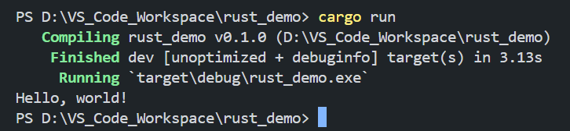

### Rust学习笔记


#### RUST语言介绍

RUST语言是一个强类型的静态语言，强类型的意思是对变量类型的约束会比弱类型的语言（比如JS）要多很多，静态的意思是程序必须在编译期就确定所有变量的类型，这些特点使得**Rust不需要GC(Garbage Collection)**，只要能通过编译期，运行时就OK，不会有内存泄露的问题。

此外，**RUST的强大体现在它的编译器，而不是VM（虚拟机），因为它根本就没有VM。**，一旦编译构建为可执行文件后，**所有的代码都会基于目标操作系统转为对应的机器码**，因此在不同的平台上跑都会确保有相同的性能，因为最终跑的是平台自己就能识别的机器码，而不是虚拟机。好处是不需要给每个可执行文件配置一个虚拟机，也不用像JAVA那样需要安装JRE，可以大幅减少可执行文件体积。


#### 入门

安装运行环境`rustup`，它是类似NVM的工具，负责安装和管理不同版本的rust编译器。首先需要C++环境，因此要安装微软的C++生成工具（不确定是否需要安装完整的Visual Studio），直接选择使用C++的桌面开发，语言包一定要选上英语：


安装完成后记得把路径加到系统变量内，路径是：

```
[root]\VC\Tools\MSVC\[version]\bin\Hostx64\x64
```

然后有2个安装rust的方案，一个是直接去下载[rustup-init](https://www.rust-lang.org/learn/get-started)，选64位版本，安装之前在系统变量里面加上`CARGO_HOME`，指向一个自定义路径，然后执行安装文件，选择默认安装方式。这个CARGO_HOME和GRADLE_HOME，NPM_HOME一样都是包管理工具，即**CARGO是RUST的包管理工具，还能构建RUST项目**。

安装完成后检查一下系统变量PATH里面是否有一个`%CARGO_HOME%\bin`，如果没有就手动加一下，它允许我们使用`cargo`命令，用来创建项目。

还有一个方案是使用MSYS2安装rust，这种方法更接近linux原生的操作，具体不介绍了。

安装好之后执行以下命令测试一下，注意大小写：

```
rustup -V
rustc -V
```

RUSTUP是管理RUST版本的工具，rustc就类似javac一样，是一个具有编译期的语言，实际上rust强大的地方就在于它的语言设计，使得只要通过了编译期，基本运行时就不会出错，也就不再需要GC进行内存管理，即**把内存管理提前到了编写阶段**。

然后是IDE了，这里用VS Code，安装好之后，去插件市场安装`rust-analyzer`，这个插件还在更新，比官方的插件更好用。

然后所需的工具基本都有了。验证cargo是否装好的命令如下：

```
cargo --version
```

之后创建项目，在工作空间里面执行此命令：

```
cargo new rust_demo
```

`cargo new`是创建项目的命令，可以带一些参数，默认情况下会创建了一个带有GIT配置的RUST项目，然后用VS CODE打开它，可以发现项目结构如下：

```
root
  |---src
  |---target
  |---.git
  |---.gitignore
  |---Cargo.toml
  |---Cargo.lock
```

简单理解一下：

- src就是源码路径
- target就是编译后的文件
- git和gitignore不多说
- Cargo.toml类似package.json，用于声明项目信息以及包依赖，它有一个VS CODE插件叫Even Better TOML，用于优化TOML文件展示效果，以及语法检查等，TOML语法还是比较简单，就是定义一组根配置（对象），每个根配置内通过key=value来控制具体的属性值，还是面向对象的思路
- Cargo.lock，类似package-lock.json，应该是用于辅助Cargo.toml进行精确依赖控制的，由Cargo自动生成，开发者不用维护它，**但是如果提交代码，这部分也要提交进去，以确保所有参与者下载的依赖版本都是相同的**

然后在VS CODE里面调出终端界面，可以通过命令行执行代码了，src里面默认创建了一个`main.rs`文件，看来rust源码的文件后缀名就是rs，它的内容是这样：

```rust
fn main() {
    println!("Hello, world!");
}
```

官方推荐的缩进是**4个空格**，这里按官方的来，具体可以查阅[官方风格指南](https://doc.rust-lang.org/nightly/style-guide/)，最重要的**命名风格，大部分时候是snake_case（文件名，变量名，方法名等）**，常量采用SCREAMING_SNAKE_CASE，其他场景遇到了再说。

然后命令行执行，注意不要cd到src里面，直接在项目根路径执行即可：

```
cargo run
```

就会开始一个正常的编译 + 执行流程，效果如下：



编译完成后可以在项目的target路径内看到编译好的文件，适配不同平台，比如windows是exe文件。RUST和JAVA一样编译和运行是分开的，此外编译后的文件，可以放在相同平台的其他设备上运行，即使对方设备没有安装RUST编译环境也可以。

`cargo run`是一个复合命令，表示检测是否有变动，如果有，重新编译，最后执行编译结果，也可以用`cargo build`来只做编译，用于验证语法和编译是否OK，如果连续执行run，因为代码没有变动，所以会跳过编译阶段直接执行上次的编译结果。


#### CARGO常用命令（后续慢慢补充）

- cargo --version，查看版本号
- cargo new [project_name]，创建RUST项目

- cargo run，检测是否有变动，如果有，重新编译，不管是否有变动，最终都会执行编译结果
- cargo build，执行编译，如果在TOML里面声明了依赖包，会先尝试下载缺失的依赖包，默认是debug模式，会在target/debug路径下产生结果，如果需要进行生产模式编译，加上`--release`参数即可，当然生产模式编译会带来更长的编译耗时，和更好的运行性能
- cargo check，检测语法是否OK，是否能顺利编译，如果build开销较大可以先用check确认语法OK后再build，check就是语法检查，在RUST里面开销很小，推荐经常使用
- cargo doc --open，本地构建当前项目所有依赖的文档，并在浏览器中打开，需要快速查看依赖包的API的时候非常管用，不过还是建议去各个依赖项目的主页找文档，会更清晰

针对一般开源项目，如果要在本地跑起来，也是用CARGO去编译：

```
git clone [example.org/someproject]
cd [someproject]
cargo build
```


#### 分割文件

学习过程中会需要写很多例子，如果全部写在main.rs内就不好维护，所以先简单学习如何分割文件。

先简单理解，一个单独的文件就是一个模块，它的使用是这样的：

- 创建一个单独的文件，RUST会把它视为单独的模块，模块名称就是文件名
- 在新文件内声明函数，并声明此函数可以导出
- 在入口文件（main.rs）把新文件声明为模块，这样就可以使用模块内导出的函数了

具体例子，先在main.rs同层级构造一个文件`hello_world.rs`，内容如下：

```rust
pub fn run() {
    println!("Hello Rust!");
}
```

这里的`pub`关键字就表示此函数已经导出了，可以供外部使用。

然后在入口文件内这样写：

```rust
mod hello_world;

fn main() {
    hello_world::run();
}
```

使用`mod`关键字来告诉编译器，把这个新文件视为一个模块，**即只能在入口文件内去让编译器把其他文件视为模块**。

最后就是使用关键字`::`来调用文件内暴露的方法了。

和JS不同，**RUST的模块内不能通过全局的单独声明变量来触发闭包，因为闭包本质上是内存泄漏的一种，而RUST是严防内存泄漏的**，因此下面这段代码是**$\textcolor{#DC143C}{错误} $**的：

```rust
let counter = 0; // 这里是错误的
pub fn run() {
    counter += 1;
    println!("counter is = {counter}");
}
```

但是RUST有别的方法可以实现，只不过写起来会有一些难度，后面会提到。


#### CARGO基本配置

CARGO镜像源配置，和NPM一样可以指定下载镜像源，通过指定为国内镜像源，可以避免开VPN，具体在CARGO_HOME对应的路径下面创建一个config.toml文件，注意TOML语法都是从一组根对象开始的，然后这样写：

```toml
[source.crates-io]
replace-with = "ustc"

[source.ustc]
registry = "https://mirrors.ustc.edu.cn/crates.io-index"
```

USTC表示中国科技大学，用它们的镜像。

**CARGO不像NPM那样可以直接配置多个源然后逐个遍历**，一般来说只能配置一个，有一种配置方法可以配置多个，但是实际使用时必须指定一个源，和只配置一个源没有太大区别，注意不要频繁更换源，每次更换源之后都会重新创建仓库索引，会比较慢。

依赖声明，在项目的Cargo.toml里面这样写：

```toml
[dependencies]
time = "0.3.34"
regex = "1.10.3"
```

注意版本号使用x.y.z表示法。

另外CARGO好像没有命令行查看某个包的所有版本的功能，如果需要可以去[这里](https://crates.io/)查。

依赖下载也使用`cargo build`命令，会在编译期间自动寻找缺失的依赖然后下载。依赖包会放在`CARGO_HOME\registry\src\[SOURCE]\`，看上去像MAVEN那样是一个本地的中央仓，而不是NPM那样各个项目有自己的依赖。


#### 猜数字游戏

这里跟随教程做一个猜数字游戏，和教程不同，不需要创建一个项目，直接在现有项目内通过分割文件的方式来搞。

需求：

- 每次游戏开始，先生成固定范围内的随机数作为答案，然后让用户不停输入去猜这个数字，猜对了游戏结束，猜错了给出对应提示，并让用户继续输入，直到猜对为止

- 支持用户输入，用户只能输入数字，如果输入其他字符或者数字超出范围则必须让用户重新输入
- 用户输入数字后，和答案比较大小，并给出过大或者过小或者猜对的提示
- 猜错时提示用户继续输入，猜对时结束游戏

样例代码：

```rust
// 使用std内相关库
use std::{cmp::Ordering, io};
// 使用随机数的库
use rand::Rng;

pub fn run() {
    println!("Guess the number!");

    // 设置随机数的范围
    let range_min = 1;
    let range_max = 100;

    // 根据范围构造一个随机数，闭合区间
    let random = rand::thread_rng().gen_range(range_min..=range_max);

    // 构造一个循环，里面让用户不停输入，直到猜中数字为止
    loop {
        let result = single_run(random, range_min, range_max);
        if result == 0 {
            break;
        }
    }
}

fn single_run(answer: i32, range_min: i32, range_max: i32) -> i32 {
    println!("Please input a number from {} to {}!", range_min, range_max);

    let user_guess: i32 = get_user_number(range_min, range_max);

    // 比较用户输入和答案
    number_compare(user_guess, answer)
}

/** 开启一个输入流，获取用户输入并转为数字 */
fn get_user_number(range_min: i32, range_max: i32) -> i32 {
    let mut user_guess: i32;
    
    // 开启一个小循环用于处理用户输入，如果是非数字就让用户继续输入，直到拿到数字为止
    loop {
        // 构造一个String类型的变量，且它的地址可变，每次获取用户输入时都要重新构造此变量
        let mut user_in = String::new();
        // 获取用户在换行之前的输入信息，并把这些信息拼接到user_in变量原有的信息后面，形成一个新的字符串
        // 让user_in变量指向到拼接后的字符串地址
        io::stdin().read_line(&mut user_in)
        // 异常处理，注意这里是链式调用写法，为了阅读便利性建议每次链式调用时，就新开一行并加上缩进
            .expect("Failed to read input");
        
        // 用户输入字符串转数字，注意parse方法是泛型方法，这里要传入具体类型
        user_guess = match user_in.trim().parse::<i32>() {
            Ok(num) => num,
            Err(_) => {
                // 用户输入不能转为数字的时候，给出提示，并让用户重新输入
                println!("Please only input numbers!");
                continue;
            },
        };

        // 如果数字超范围则不采用
        if user_guess > range_max || user_guess < range_min {
            println!("Please input a number between {} and {}!", range_min, range_max);
            continue;
        } else {
            break;
        }
    }
    
    // 不带分号结尾表示返回一个表达式
    user_guess
}

/** 比较2个数字 */
fn number_compare(a:i32, b:i32) -> i32 {
    let result = match a.cmp(&b) {
        Ordering::Less => {
            println!("too small");
            -1
        }
        Ordering::Equal => {
            println!("You guessed right, you win!");
            0
        }
        Ordering::Greater => {
            println!("too big");
            -1
        }
    };
    result
}
```

步骤分解：

- 随机数通过引入rand库来实现
- 用户输入通过std::io来实现
- 用户输入的处理通过循环loop来控制，输入的都是字符串，是否能转数字通过parse方法确定，转为数字后再判断大小，超出输入范围也提示重新输入（其实没有必要，只要是数字就可以比较大小，加上当然更易用）
- 用户输入完成后和随机数比较大小并返回比较结果和提示
- 把用户输入 => 比较大小看作一个循环，每次循环拿到猜测结果，猜错时继续这个循环，猜对了结束循环，同时结束游戏

最后基于这个设计先完整写一遍，然后优化一下结构，把各个环节抽取为函数。


#### 基础概念和语法

**关键字不能用于任何的变量或者函数**，比如for | loop | match | if等等，这个算是所有编程语言的常识了，原因是解析器遇到关键字就是会无条件当作关键字来构造语法树。


##### 声明和表达式和代码块

RUST里面，一般在代码块或者函数的末尾，用一个**不带分号的运算来作为表达式**，而带分号的，不管其内容，都会被视为一段指令：

```rust
// 这是一个表达式，变量声明，也可以把等号右侧的3看作一个表达式，但是整体上它是一个声明
let a = 3;
```

**表达式本质是一个值**，值要么给变量绑定要么用于运算结果，指令就是运算或者绑定本身，所以`let a = (let b = 3);`会报错，因为指令不是值，是运算过程，指令不能绑定给变量，只有表达式可以，比如`let a = 1 + 1;`，这里的`1 + 1`就是表达式。

表达式则一般用于函数的返回值，或者一些流程控制的片段末尾，可以省略`return`关键字，不省略时就要用`return [expr];`（注意这里带了分号，所以是一个指令）来表示函数或者代码块的返回值：

```rust
// 以下两种返回写法等价
fn test() -> i32 {
    return 3;
}

fn test2() -> i32 {
    3
}
```

RUST内可以通过`{}`符号随意地构建代码块，一个代码块就是一个作用域，比如：

```rust
{
    println!("code block");
}
let b = {3}; // 这种算是最简单的代码块了，它直接返回一个表达式
println!("{}", b);
```

代码块可以理解为JS里面的IIFE（立即执行的函数表达式），它里面既可以包括指令，也可以用表达式返回结果，只有返回了结果的代码块，可以绑定到变量。此外像函数，或者是后续提到的流程控制等，都会结合`{}`符号，这些也是代码块。


##### 变量声明

**单独的`let`修饰的变量是不可变的**，类似JS里面的`const`：

```rust
let a = 3;
```

如果后续修改let变量的值，在编译期就会报错，比如：

```rust
let a = 3;
a = 4; // 到这里就会报错

if a > 2 {
    a = 5; // 可能的修改也不可以
}
```

换言之**单独用let关键字修饰的变量，是在任何条件下都不可变的**，这里先不考虑对象变量的问题，RUST里面的所谓的对象也要遵守相同的规则。**可变性和不可变性，结合借用机制，是RUST能保证运行时无GC且不出BUG的前提**。

如果需要它可变，就要使用`let mut`修饰：

```rust
let mut a = 3;
a = a + 2;
println!("result is {}", a);
```

**注意这里的可变性是指变量的值可以改，但是类型不能改**，如果尝试修改类型，也会报错，比如：

```rust
let mut a = 3;
a = "some text2"; // 这行会报错，因为改数据类型了
```

**正因为`mut`无法解决修改变量类型的问题，所以RUST通过变量遮盖（shadowing）来解决需要同一个变量但是也需要它能改类型的问题**，比如：

```rust
let a = 3;
println!("a is {}", a);
let a = "some text"; // 不会报错
// 下面直接开启一个作用域
{
    let a = "another text";
    println!("a is {}", a); // 这里当然会输出another text
}
println!("a is {}", a); // 输出some text，因为上面的作用域结束了
```

变量遮盖可以视为在同一个名称的变量上叠加不同的值，每个值都有其作用域，当到达作用域边界外时，这个值就失效了，因此它从这个变量上撤下，即不再遮盖，这样此变量就指向了它被遮盖之前的值。

**变量遮盖的最佳实践就是希望表示同一个概念，但是需要转换类型的时候，其他场景下会产生歧义**，如果类型不会变，直接用`mut`吧。

`const`在RUST里面也是关键字，用于修饰完全不可变的变量，就是字面意义上的常量，完全不可变（不能用`mut`修饰），而且声明时需要声明类型，比如：`const a: i32 = 3;`，不过从编程风格上，因为它完全不可变，一般都会用SCREAMING_SNAKE_CASE风格来命名，所以最佳实践写法是：

```rust
const DAYS_OF_WEEK: i8 = 7;
const LOOP_INTERVAL_IN_SECONDS: i32 = 60 * 60 * 24;
```


##### 数据类型

RUST里面数据类型分2类，scalar和compound，前者可以理解为基本类型，后者可以理解为复合类型（不要理解为对象类型，RUST包括了一部分面向对象特性但它本质不是基于面向对象设计的），但不管是哪种，编译器都必须对所有变量的类型有完全的掌握，掌握了类型就确定了变量的大小范围，一些不定长的比如数组，字符串等，和其他的语言一样都会存于堆内，而**定长的基本类型都放在栈内，其大小在编译期就确定了，一旦开始运行，给它分配的空间就是确定的，后续不会再有变化**。


##### 数据类型--基本类型

此外基本类型也不是一般面向对象编程里面的那种基本类型，它里面还是有封装一些方法的。

基本类型包括整数，浮点，布尔，char，就4种。

整数类型表示如下：

```rust
let b: u8 = 0;
let c: u8 = 255;
println!("{}, {}", b, c);
```

类型说明如下：

| 类型关键字    | 类型说明                                                     |
| ------------- | ------------------------------------------------------------ |
| i8 / u8       | 8位长度                                                      |
| i16 / u16     | 16位长度                                                     |
| i32 / u32     | 32位长度                                                     |
| i64 / u64     | 64位长度                                                     |
| i128 / u128   | 128位长度                                                    |
| isize / usize | 长度根据平台确定，比如早期X86架构下就是32位长度，一般现代电脑都是64位长度 |

i开头的表示支持负数，所以边界值是$-(2^{n-1})$到$2^n - 1$，所以i8范围是-128到127。

u开头的表示不支持负数，所以边界是从0到$2^n$，所以u8范围是0到255。

另外整数型的写法可以有多种，常见的有：

```rust
let int1: i32 = 34567; // 标准写法
let int2: i32 = 34_567; // 更优雅的十进制写法
let int3: i32 = 0xFFF; // 16进制写法
let int4: i32 = 0b10010010; // 2进制写法
let int5 = 1; // 默认是i32类型
println!("{}, {}, {}, {}", int1, int2, int3, int4);
```

不声明类型时，解析器默认使用i32。

基本类型存于栈内，大小在一开始就确定了，而数学运算可能会导致类型溢出，RUST需要对此做处理，在开发模式下，遇到此类问题会直接报错，而生产模式下默认会采用溢出后从头开始循环的策略，比如u8的256会等于0，u8的257会等于1，如果需要在业务逻辑上感知溢出并处理，简单的方法是：

```rust
let overflow: u8 = 254;
match overflow.checked_add(4) {
    Some(v) => println!("success, {}", v), // 没有溢出，正常往下走
    None => println!("overflowed") // 溢出了，做异常处理
};
```

后续可以通过一些封装类型，在变量声明的时候就给定了溢出的处理策略，以减少每次运算都要调用溢出处理方法的问题。

浮点类型只能针对十进制，都支持负数，类型是`f32`和`f64`，默认是`f64`因为要支持现代的平台。写法就是正常的比如`1.0`，`3.1415926`等等。注意**由于不声明变量类型时，默认是i32整数型，会导致除法类数学运算产生偏差，忽略小数的部分，所以需要更精确的数学运算时，建议都显式声明为浮点类型**。

布尔类型没什么好说的，和其他语言基本一样，关键字是`bool`，值是`true`和`false`。**RUST里面不支持JS的那种布尔隐式转换，所以`let a: bool = 1;`这种写法会报错**。

char类型，就是单字符类型，写法如下：

```rust
let single_char: char = 'X';
```

类型是`char`，**用单引号表示一个字符**，所以RUST内**双引号表示的都是和字符串相关的，不会和char相关，哪怕是双引号包裹一个单字符，也被视为字符串相关**。char的长度是4byte，也就是32位，UTF-8下中文一般是3byte，所以char类型几乎可以表示所有的语言的单个字符。

还有一种写法是char之前加一个b，表示char的byte值，比如：

```rust
let a = b' '; // 表示空格的byte值
println!("{}", a); // 输出32
```


##### 数据类型--基本的复合类型

注意这个标题，基本的复合类型，即有很多种复合类型，这里只介绍最基本的复合类型。

tuple，中文翻译叫元组，更准确的翻译是**有限复合集**，比如couple => triple => n-tuple。在RUST内tuple表示一组有序列的，多类型的（可以是基本类型和复合类型，不限定）的变量集合，它的特点是：

- 元素数量固定，一旦声明了其元素数量不可变
- 有序的元素类型，即每个元素都可以自由选择其类型，但是各个位置上的元素，其类型不可变

所以对tuple最好的理解是，**它是一个有限复合集，每个元素都有其序号和数据类型，且集合不可扩容或者缩减，元素类型也不可变更**。

写法如下：

```rust
let cube_size: (i32, i32, i32) = (100, 20, 40);
println!("cube length = {}, width = {}, height = {}", cube_size.0, cube_size.1, cube_size.2);

let item = ("potion", 5); // 让RUST自己去推导tuple的类型
let (item_name, item_quantity) = item;
println!("item: {}, quantity: {}", item_name, item_quantity);

let location: (f64, f64) = (108.35678, 46.34567);
let (lat, lng) = location;
println!("lat = {}, lng = {}", lat, location.1); // 基本类型的tuple在被解构后依然可以访问到
```

每个tuple变量都表示一个允许多类型元素的集合，因为是有序的，所以可以用`.[下标]`的方式访问，从0开始，也可以通过`let ([var1], [var2]) = [tuple]`这种方式去解构tuple（这里就涉及到所有权了，暂时先理解为解构）。

tuple本质上要作为一个数组来看待，而且支持多类型使得它更具有业务意义，当业务需要返回一些复杂信息，但是又不希望用更复杂的面向对象的处理方法时，就可以采用tuple，比如API接口类型的可以是`(i32, data)`表示响应码和响应体，地点坐标的可以是经纬度，物体尺寸的可以是长宽高。**tuple元素不宜过多，这样业务上好理解**。

array，即数组类型，RUST中的数组特点如下：

- 和tuple一样也是固定长度
- 所有元素必须是同一种类型

举例：

```rust
let arr1 = [1,2,3,4];
let arr2: [u8; 3] = [1, 1, 1]; // 显式声明了数组类型
let arr3 = [10; 2]; // 等于[10, 10]
let arr4: [u8; 2] = [10; 2]; // 声明类型的同时也创建了元素
println!("arr1 first = {}", arr1[0]); // 通过下标访问
println!("arr1 last = {}", arr1[5]); // 会在编译期报错
```

由于数组是固定长度的，因此在编译期就可以确定通过下标访问是否会越界。


##### 函数声明

一个RUST项目要能通过`cargo run`跑起来，需要有一个入口模块和对应的入口函数，约定俗称的就是main.rs和main函数。

函数声明的语法是：

```
[函数修饰符，非必要] fn [函数名称](参数1: 类型, 参数2: 类型......) -> 返回值的类型(如果没有就用括号代替或者省略箭头) {
    // 函数体和返回值
}
```

函数名称和变量名称一样采用snake_case风格，**返回值类型不能像变量那样自动推导**，即如果函数体内有返回值，则必须显式声明返回值类型，没有返回值类型时，可以省略箭头，或者写为括号，比如`fn no_return_value() -> () {}`，所以省略箭头就是语法糖，相当于显式声明返回`()`类型。

**函数体的`{}`不能省略**，所以一个带了返回值的最简单的函数要这样写：`fn test() -> i32 { 99 }`。

**函数声明不分先后顺序**，因为RUST有完整的编译阶段，所以只要在编译期结束之前，RUST能定位到代码内调用的函数所指向的实现，就没有问题。

注意函数体既然用到了`{}`，那么本质就是代码块了，而**代码块内是可以声明函数的**，所以**函数内也可以继续声明函数**：

```rust
fn main() {
    let a = get_a();
    println!("result is {}", a);

    fn get_a() -> i32 { 99 }
}
```


##### 注释写法

```rust
// 单行注释，写在本位置后面的内容全部都视为注释
/* 行内注释，写在本位置内的内容都是注释，可以在本注释前后加代码 */
let /* 行内注释可以写到代码空格的位置，虽然不建议这样写但是也不会报错 */ b: i32 = test();

/*
 * 行内注释通过换行可以转为多行注释，为了美观每行开头可以加一个星号，当然不加也可以
*/

// 下面描述如何写一个API的注释
/// 对函数整体的描述，返回值的含义写在这里
/// * `arg1` 对入参的描述
fn test(arg1: i32) -> i32 { 
    99 
}
```

RUST目前还不支持`@foo`这样的注释，如果要写文档基本就是用`///`符号，加上格式化的文字来描述一个函数或者变量它的作用。


##### 流程控制

最常用的写法是使用`if / else if / else`来处理流程控制，比如：

```rust
let number = 3;

if number < 5 || number > 8 {
    println!("condition1");
} else if number >= 5 && number < 8 {
    println!("condition2");
} else {
    println!("some strange condition");
}
```

条件本身不要带括号，此外注意if本身也是接代码块的，因此也可以用表达式来返回，且进行赋值，比如：

```rust
let a = if condition { 5 } else { 6 };
```

这里要注意**if条件中所有代码块都要返回相同类型的值，还是那个老问题，在编译期，所有变量的类型都要确定下来**，因为类型跟分配的内存大小直接相关。

还可以用`loop`结合`continue / break`来控制流程，这个在之前的猜数字游戏里面已经演示过了，这里再写一个例子：

```rust
let mut counter = 0;
loop {
    if counter > 5 {
        break;
    } else if counter == 4{
        counter += 1; // 这里修改了counter的增加量，并且跳过了循环中的其余流程，导致最后退出循环时结果不同
        continue;
    }
    counter += 2;
}
println!("end, counter = {}", counter);
```

还可以用`while`代替`loop`，多了一个每次循环时的条件检测，不复合条件时会自动退出循环，举例：

```rust
let mut number = 3;
while number > 0 {
    if number == 1 {
        number -= 2; // 这里修改了循环到1的时候的流程
        continue;
    }
    number -= 1;
}
println!("last number = {number}");
```

因为能自动退出循环所以可以不写break，但是结合条件语句还是能用continue控制循环节点。

for循环，常用的是for in写法，可以遍历数组但是不能遍历tuple（因为tuple是有限复合集，元素类型是可变的，不能赋值给单一的迭代器变量），举例：

```rust
let arr = [1,2,3,4,5];
for ele in arr {
    println!("for loop, ele = {ele}");
}
```

如果要在遍历时拿到元素的下标，则需要显式地使用迭代器处理，这个后面会提到。


#### 所有权

所有权是RUST的核心设计，就是基于这个设计可以实现运行时无GC，所以它最重要的特点是可以保证内存安全。


##### 什么是所有权

所有权是RUST管理内存的一套规则，也是用于规范代码的规则。

早期的编程语言采用完全开放给开发者的策略，即开发者要手动指定内存空间存放数据，并在使用完成后手动释放空间，**这导致了极大的编程难度**，因为一次分配必须对应一次释放，中间有太多容易出错的地方，比如分配过小，没有释放，过早释放，释放多次，都会导致程序运行出BUG，因此后期的编程语言大都采用自动化的管理机制，即GC，通过开启一个GC线程来持续扫描内存中的变量，找出不再被使用的部分然后销毁。但有好处也有坏处，GC线程的存在会导致运行时的额外开销，而且不同的GC有不同的策略，巧妙的编写有时候可以让变量逃脱GC的控制，因此也无法杜绝内存泄漏的问题。

为此，RUST采用的是代码规范+编译期校验的方法，即如果代码不规范，或者编译期校验没有通过，则根本不会开始编译和运行，反之，如果都通过了，则能保证运行时不会有内存泄漏的问题。

要理解RUST的所有权就要先理解RUST的内存管理机制。和大部分编程语言类似，RUST也是通过栈和堆来管理内存的。栈就是先进后出，栈顶元素是最后加入的，但是最先出去的，此外**所有栈内变量都必须要在编译期就知道它的最大长度**，因为栈的内存也是有限的所以不可能存储像字符串这样的不限制大小的变量。所以所有在编译期不能确定最大长度的变量，统统都要存到堆里面。

堆的内存管理比较松散，**如果把栈理解为叠盘子，那么堆就是码头仓库**，需要的时候申请一块空间，用于堆放货物（变量），用完之后把货物挪走（变量销毁），清出空间，供下一批货物使用，有些货物体积大，占用空间就多，有些体积小，占用空间就少。有时候一个大体积的货物被清走了，它留下的空间可以够放好几个小体积的货物。当存放了货物后，这个货物的所有者就可以拿到这个货物在仓库中的位置坐标，这个坐标会被所有者存于栈内，由于仓库的大小是固定的（RUST运行时不可能给堆分配超出平台限制的内存地址），因此它内部所有货物的可能的坐标也是能确定大小的，因此它就一定可以存于栈内，即货物坐标在栈内，货物本身在堆内。

栈的管理是严格大小的，后进先出的，堆的管理是松散的，空间的分配是临时确定的，因此操作栈比操作堆更有效率。

RUST基于栈堆内存管理机制，设计了以下所有权的基本规则：

- 每个值都要关联一个所有者（owner）
- 每个值，在任何时间切面上看，都只能关联一个所有者（特殊情况下允许多个，后面会提到）
- 所有者消失时，它关联的值也必须消失

现在以这个代码为例解释以下所有权：

```rust
let s = "hello";
```

上述代码，变量s就是所有者，它关联的值是字符串切片hello（不是字符串类型，两者区别后面会提到），由于变量s处于一个代码块中（最少它也要放在一个函数内执行），因此当执行到代码块的外侧时，此变量s就要消失，它关联的值，字符串切片hello也必须消失。


##### 用字符串类型来解释所有权

**基本类型的变量无法解释所有权的概念**，因为基本类型都是存在于栈内，大小已知，**RUST给这些基本类型都加上了copy特征**，把它们的赋值操作都变为了**复制**操作，导致它们用起来和其他的编程语言没有什么区别，比如下面这段代码是正常的：

```rust
let a = 3;
let b = a;
let c = a + b;
```

关于特征的部分后面会提到，这里简单了解就是，基本类型之所以可以随便用，就是因为RUST给它们加上了copy特征。所以，要解释所有权只能用RUST没有加copy特征的类型，也就是复合类型，存于堆内的，而字符串，`String`类型，就是一个很好的例子，比如我们需要一个字符串变量，它的值只能在运行时确定时，应该这样写：

```rust
let mut s = String::from("");
println!("text is {s}, end");
s.push_str("hello string");
println!("text is {s}, end");
```

通过`String::from`来构建一个字符串类型，这里`foo::bar`表示调用的是foo这个类型上的静态方法。然后是字符串拼接，因为要拼接，等于修改了值，所以变量必须是可变的，要加`mut`关键字修饰，然后通过`push_str`来拼接值。但是注意，字符串字面量，也就是**代码内直接写死的字串，是没有这个方法的**，比如下面这段代码会**$\color{#DC143C}{报错}$**：

```rust
let mut s2 = "aa";
s2.push_str("bb"); // 到这里就报错了
println!("{s2}");
```

这里就牵扯到了写死字串和字符串的类型区别。写死字串，其大小长度，编译期是已知的，因为它写死了，但是它也不是存于堆内，**而是会直接保存在编译后的二进制文件的只读数据区域内**，所以如果在代码内写死，保存了一部小说，这部分小说也只是会增大编译后的二进制文件的总体体积，不会对运行时的堆有什么影响。

字符串类型的变量，初始化时会在堆上分配一块空间，这个代码`let mut s = String::from("");`表示在堆上分配了空间后，**把地址返回给变量s**，s就是这个值的所有者，所以按照所有权的基本规则，**当代码执行到s所在代码块外侧时，s会消失，它关联的堆上的值也会被释放**，即：

```rust
{
    let mut s = String::from("");
    
    // 做一些字符串的操作
}
// 到这里，s就消失了，它的值占用的堆空间也被释放了 
```

 然后讨论一下可变这一概念，实际上`mut`关键字只是告诉编译器，**允许它修饰的变量在语法上执行一些修改值的操作**，对上述的字符串所有者s来说，无论是`s = String::from("new value");`或者`s.push_str("new value");`，RUST在本质上做的事情是一样的，在现有分配的空间内操作，如果空间不够时，分配新的空间，**无论何种操作，完成后，都要反向更新变量s内的指针**，所以所有者的核心概念是：**值在堆内存更新后，它的地址会反向更新到的变量**。所以不要把RUST内的pointer（指针）理解为一个单向的过程，**所有者的pointer都是双向的**，当然非所有者（后面提到的引用）的pointer都是单向的。

在具有GC机制的语言中，经常会需要处理对象的mutate和reassign区别，比如JS中，这样的代码是会出问题的：

```javascript
function alterObj(obj: Object) {
  obj.attr = 'new attr'; // 这里OK
  obj = new Object(); // 这里会出问题
}
```

之所以会这样，是因为mutate不会修改对象的内存地址，而reassign会，所以如果有多个变量指向了同一个内存地址，reassign就会导致这些变量指向不同的内存地址。

而在RUST里面，**因为具有所有权的概念，mutate和reassgin是统一的，因为所有者的pointer是双向的，无论何种修改，都会被更新**。

所以RUST里面，**所有者的定义是：持有一个pointer指向和它绑定的值，且这个值在内存中被重新分配后，pointer也会被同步更新**。

由于字符串有真正的所有权的概念，下面这段按照基本类型的赋值，引用的操作，在字符串这里会报错：

```rust
let mut s = String::from("");
s.push_str("hello string");
let s2 = s; // 这里不是基本类型的简单赋值，是所有权转移
println!("s2 is {s2}, end");
println!("s is {s}, end"); // 这里会报错
```

变量s在栈内的pointer实际上包含了3个部分：字符串值在堆的地址，长度，占用空间，注意长度是这个字符串值当前的长度，而占用空间是OS给它分配的可以用到的最大空间，如果字符串操作导致长度超出了占用空间，OS就要重新找一块地方给它分配更大的空间，也就是会有一定的性能开销，此外，pointer包含的地址会在堆空间修改后同步更新。

如果按照基本类型的赋值去理解，**当s赋值给s2时，并不是在堆空间赋值了一份s关联的堆空间的值，而是仅仅把地址，长度，占用空间进行了复制**，那么就会出现一个问题，同一个堆上的值，有2个变量对其拥有所有权，**那么当任何一个变量离开了它的作用域时（s2不一定和s处于同一个作用域），是不是都要销毁对应的堆空间**？比如：

```rust
let s2:String;
{
    let mut s = String::from("");
    s.push_str("hello string");
    s2 = s; // 如果这里是让s2也变成所有者，那么当执行到s的作用域外侧时，s消失，s2会如何？
    println!("s is {s}, end");
}
println!("s2 is {s2}, end");
```

这样的设计会带来2个明显的问题：

1. 如果后续还要用到s2，那么s2的值因为已经销毁了所以不能再用
2. 反复释放同一个空间会导致BUG

所以RUST规定，当出现复合类型的赋值行为时，视为所有权的转移，即`let s2 = s;`**视为s的pointer转移给了s2，同时s的生命周期走到尽头，语法上无法再次使用**，也因此s就该销毁了。

既然s会在所有权转移时被销毁，那么这段代码也会**$\color{#DC143C}{报错}$**：

```rust
let mut s = String::from("");
s.push_str("hello string");
let s2 = s; // 这里s就销毁了
println!("s is {s}, end"); // 因为s销毁了，所以不能再被其他代码调用
```

这里RUST会提示borrow of moved value，即变量s在所有权转移后仍被别的代码借用。所以在RUST中不要随便赋值，如果是复合类型，一定会发生所有权的转移，从而终止原变量的生命周期。


##### 所有权和复制行为

**基本类型之间的赋值，本质是复制**，因为值都是存于栈上，大小已知，且一般都很小，复制起来性能开销也少。

复合类型之间的赋值是所有权转移行为，会导致旧变量的生命周期终结。但一些复合类型提供了对应的方法，以满足特殊场景下的需要，比如字符串就有一个实例方法叫`clone`，用法如下：

```rust
let s2:String;
{
    let mut s = String::from("");
    s.push_str("hello string");
    s2 = s.clone(); // 这里所有权没有转移，是真的在堆上复制了一份，所以s2持有的地址和s是不同的
    println!("s is {s}, end"); // 因为s的所有权没有转移，所以这里是正常的
}
println!("s2 is {s2}, end");
```

复合类型里面有集合类型tuple（有限复合集）和数组，两者其实也实现了复制，前提是它的元素都必须全部是基本类型，比如：

```rust
let tup1: (i32, i32) = (1, 2);
let tup2 = tup1; // 都是基本类型，所以也是复制
println!("tup1 is {}, {}", tup1.0, tup1.1);

let arr1 = [1; 2]; // [1,1]
let arr2 = arr1; // 这里也是复制，因为元素都是基本类型
println!("arr1 is {}, {}", arr1[0], arr1[1]);
```

**所有的函数传参本质都是赋值，把值传递给了形参**，具体是复制还是所有权转移，根据具体的参数类型确定，比如：

```rust
let s3 = String::from("haha");
move_example(s3);
println!("s3 is {s3}, end"); // 这里会报错

fn move_example(a: String) {
    println!("param ownership is moved"); // 即使函数内没有用到入参，所有权还是转移给了形参
}
```

上述代码中，move_example因为把值转移给了形参，而形参的作用域就是函数本身，因此函数执行完成后，形参就被销毁，值也一样。

**所有函数的返回值本质也是赋值**，这个更好理解，如果返回的是基本和其相关类型，就是复制，如果返回的是字符串，就是所有权转移。


##### tuple和数组的默认行为

tuple是一种特殊的Struct（结构体），这个在后面会提到，这里简单说一下，因为tuple可以包含多种类型，如果强制要求tuple类型或者数组类型只能是赋值导致所有权转移，那么在编程实践中会比较麻烦，比如数组过长的时候，取得其中的某个下标，或者要求修改某个下标，在结合第三方库的情况下开发都会很困难，所以RUST做出了一个决定，**当tuple内所有元素，单独拎出来进行赋值都是复制时，那么tuple自身的赋值也就是复制，数组也有对应特性**，比如：

```rust
let tup1: (i32, i32) = (1,2);
let tup2 = tup1; // 这里是复制
println!("tup1 is {}, {}", tup1.0, tup1.1);

let arr1 = [1; 2];
let arr2 = arr1; // 这里也是复制
println!("arr1 is {}, {}", arr1[0], arr1[1]);
```

反过来，如果tuple内包含了具有所有权机制的元素时，tuple自身的赋值就是所有权转移了，数组也是类似。

**tuple和数组默认都是存在于栈上**，因为编译时大小已知且不能更改，当然如果它们包含的元素是大小未知的，处理也是类似，只会保存地址，具体的值还是在堆上。


##### 引用和借用中

首先它们不是同一个概念，RUST设计这个机制就是为了解决不能随意赋值的问题，当然在不违反所有权原则的前提下。

既然复合类型的所有者持有了堆地址，而且无法轻易转移，那么把这个所有者在栈里面的地址也当作一个地址就可以，这个就是引用的概念，即：

```
引用变量 => 栈里面的所有者 => 堆内的值
```

引用就是二次地址，**即所有者的堆地址在栈内保存的地址**，使用`&`符号来表示，比如函数传参的问题，可以把入参替换为引用类型：

```rust
let s3 = String::from("haha");
let size = get_str_size(&s3);
println!("s3 is {s3}, length is {size}");

fn get_str_size(a: &String) -> usize {
    return a.len();
}
```

String的引用型就是`&String`，变量s的引用就是`&s`，以此类推。

引用符号`&`后续会经常出现，有时候会比较复杂，比如`&[expr]`，表示的是一个表达式计算结果的引用，举例：`&Self::Target`，这个后面会提到是一种关联类型的表述方法，即一个类型的关联类型的引用，即**`&`符号是对它后续跟着的所有的表达式生效的**。

也可以把引用赋值给其他变量，比如：

```rust
let s = String::from("haha");
let s_ref = &s;
let s_ref2 = s_ref; // 这里不会导致所有权的转移，因为s_ref自身并没有所有权，但是会导致增加了2个借用者
println!("{s_ref}, {s_ref2}");
```

这种从一个所有者变量中创建一个引用变量的行为，就叫做借用，**更精确的说法是把所有者添加了”借用中“这一状态**。为什么直接不说借用？而是用**添加了借用中的状态**这一更复杂的说法？虽然引用不会破坏现有的所有权状态，但是它会带来生命周期的问题，就上述代码而言，s_ref和s的生命周期应该是如何的？显然，s_ref，即**借用者，必须要活在被借用者，即所有者的生命周期内**。而反过来，当要销毁一个所有者的时候，必须确保它没有`借用中`这一状态，即所有基于它的借用者（引用变量），都要在它之前销毁，比如：

```rust
let s4 = String::from("owner");
let s5 = &s4;
move_ownership(s4); // 这里就会报错
println!("s5 is {s5}");
```

上述代码为什么报错？考虑下两者的生命周期就好理解了，s4是所有者，s5是对其的引用，导致s4加上了借用中的状态，s4的生命周期在进入move_ownership后就结束了，但是后续一行依然再调用s5，显然s5的生命周期要长于s4，这是不被RUST允许的，因此当s4销毁时，s5必须在更早的时候销毁，否则编译器会提示cannot move out of xxx because it is borrowed，所以RUST里面的借用，应该这样理解：

- 给被借用方，一般是所有者，添加了借用中的状态
- 可以给同一个所有者创建多个引用，即添加多个借用中的状态
- 所有引用的生命周期都必须被包裹在被借用方的生命周期内
- 被借用方销毁，或者其地址发生变化后，禁止和它有关联的引用者继续存在

所以**一般写引用的时候都不会显式地赋值给变量**，而是直接`&`符号引用，这样的好处是用的时候才创建引用，用完了变量离开它的作用域自然就销毁了，也就不会影响到所有者。


##### 可变引用

一般的引用，即不可变引用，其本质是**创建一个固定的的变量和单向的pointer**，用于在不改变所有者的情况下访问所有者的内部结构。

业务上经常又会要求开发者能对一个变量进行修改，且最好能避免发生所有权转移，这意味着**需要让所有者能让渡出修改权**，RUST在这里是这样设计的：

- 所有者不需要转移所有权，因此其pointer依然是双向的，也对值的生命周期有完全的掌控
- 为了让引用者可以修改，所有者需要让渡值的修改权
- 为了避免多方引用者修改值，在任意时间切面上，只允许存在1个具有修改权的引用方，或者多个不具有修改权的引用方

举例：

```rust
let mut s4 = String::from("owner");
let s5 = &mut s4;
println!("borrowed {}", &s4); // 到这里就报错了，因为可变引用的生命周期还未结束
s5.push_str("ship");
println!("s5 is {s5}");

let mut tup = (String::from("a"), String::from("b"));
let mut_ref = &mut tup;
let v1 = mut_ref.0; // 这里会报错，可变引用无法转移所有者的部分所有权
```

通过`&mut foo`创建可变引用，也需要所有者是`mut`修饰的，这样所有者才能让渡修改权。

**可变引用的本质，和不可变引用一样，都是创建一个固定的变量和pointer，指向所有者在栈内的地址**。RUST只是在编译器层面上控制可变引用的生命周期，以及可以执行的操作，比如当可变引用的操作可能导致所有者的pointer变化时，此时间切面上不能存在其他的引用变量。可变引用自身的pointer也不会修改，**即使修改了所有者的值，被更新的也是所有者的pointer，可变引用自身还是指向同一个所有者在栈内的地址**。

可变引用和不可变引用都不能执行所有权的转移，对于集合变量的所有权也是同理，虽然对于tuple来说原则上可以做到使用可变引用来转移其子元素的所有权（tuple自身所有者的pointer会保持不变），但是对其他的集合变量，比如可变数组，set，map等，这样的操作一定会带来问题，因为它们自身的pointer是可能会变化的，所以**RUST出于内存安全的考虑，禁止了一切可变引用进行所有权转移的行为，不管是变量自身的所有权转移还是局部的所有权转移**。


##### 字符串切片

由于字符串本质是一个不限长度的数组，因此具有子数组的概念，所以可以通过切片写法来创建`&str`，即字符串切片类型，写法如下：

```rust
let a = "hello rust"; // 对所有写死的字串都是字符串切片类型
let b = String::from(a);
let c = &a[3..8];
println!("{c}"); // 输出lo ru
```

RUST把所有硬编码的字串都存到了二进制文件只读区域，相关变量都视为从这些区域读取的字符串的完整截取，因此还是`&str`，所以它们不可更改（这里的更改不是mut那种，而是不可继续拼接）。

如果需要编写多行的字符串切片，可以使用`r#"`开头和`"#`结尾：

```rust
let multi_row = r#"
	第一行信息；
	第二行信息；
	第三行信息；
"#;
```

注意这种写法也会把缩进的部分包裹进来，即实际的内容除了换行符之外还会包含缩进内容，因此处理的时候需要去空格。

字符串切片和字符串的区别如下：

- 字符串是完整的类型，可以修改
- 字符串切片是引用类型，而且是字符串的子数组，不能修改

**因为字符串切片是引用类型，所以它的生命周期还是受制于所有者的生命周期**，所以这种代码还是会**$\color{#DC143C}{报错}$**：

```rust
let a = String::from("hello rust");
let b = &a[3..10];
move_ownership(a); // 这里就报错了，因为b的生命周期比它的所有者a更长
println!("{b}");
```

还可以通过`&foo[a..b]`这种写法来表示一个子串，其中a和b各自表示开始和结束下标，b不包含。**既然是下标，就会有数组越界的问题，b的值不能超过字符串的最大长度**。

当开始下标是0时，可以省略，以下写法等价：

```rust
let a = String::from("hello rust");
let b = &a[0..3]
let c = &a[..3];
```

当结束下标是字符串最末尾时，也可以省略，以下写法等价：

```rust
let a = String::from("hello rust");
let b = &a[3..10]
let c = &a[3..];
```

所以`&a[..]`这种开始结束下标都省略的写法就表示对字符串进行完整的截取，当然类型还是`&str`，和`&a`类型是`&String`还是有区别。

字符串切片在实际编程内的用处很大，因为很多场合下需要对变量进行反复地修改以及重新赋值，如果都用&String处理则所有权规则会导致可变引用和不可变引用的编写麻烦，反过来如果都用&str来处理，那么第1，所有权没有变化，不会产生副作用；第2，操作的都是下标，性能更好。因此**推荐在函数声明入参中，需要字符串的时候，尽量用&str来代替**。

对于形参是&str的，传入&String会自动转换。

如果需要把String转为&str，可以使用String的`as_str`方法。


##### 宏命令的赋值行为

为什么println!可以直接传入字符串，而不用担心所有权转移的行为？因为它是一个宏（macro），不是一个函数。**宏的意思是元编程**，即println!()会在编译后转为一个正常的打印函数，而在那个函数内，它对入参做了处理，如果传入的是所有权变量，会统统转为`&`引用，所以println!宏最后生成的函数，是传入了引用变量，所以不会发生所有权转移的行为。

RUST里面还有其他的宏命令，**不是所有宏命令都会自动把所有权转换为引用，需要使用时单独确认**。


#### Struct（结构体）

RUST中的结构体从形式上有点像面向对象里面的类的概念，或者接口，具有极强的类型定义和校验的能力，实践中，一个完整的程序会需要大量自定义结构体来完成。

注意，**匿名tuple（也有具名tuple）是一种特殊的结构体，RUST对它做了一些增强**，因此在某些场景下（比如全都是基本类型的tuple，可以自动实现复制）我们**自定义的结构体如果需要达成和tuple一样的特性，还是要手动实现**。


##### 声明结构体

和面向对象类语言中，声明类或者接口类似的写法，**名称采用`UpperCamelCase`，即首字母大写的驼峰命名规范**，举例：

```rust
struct BodyCondition {
    height: u8,
    weight: u8,
}

struct User {
    name: String,
    age: u8
}
```

注意`struct`是关键字，最后一行逗号可加可不加。此外，struct可以直接声明在模块根节点，可以在根节点的任意位置：

```rust
struct Foo {}

fn main() {
    // do something
}

struct Bar {}
```

然后基于结构体可以创建对应类型的变量，比如：

```rust
let user1 = BodyCondition {
    weight: 10, // 具体构造时成员变量的编写顺序随意
    height: 120,
};
let u1 = User {
    name: String::from("Arc"),
    age: 10
};
```

注意上述代码中的BodyCondition，**虽然它的所有成员类型都是基本类型，但它还不能实现复制**，因此赋值会发生所有权转移，如果要实现复制，还需要手动添加代码。

获取成员变量依然是采用`foo.bar`形式，和tuple一样，也可以说tuple是有成员变量的，名称是0，1，2，3等等。

**可变`mut`关键字只能用来修饰一个完整的结构体变量**，不能单独用来修饰它的成员变量，所以即使只希望对一个成员变量进行改动，整个结构体变量也必须要可变：

```rust
let mut u1 = User {
    name: String::from("Arc"),
    age: 10
};
u1.age = 20;
```

结构体还有一些简写的方法，比如当值对应的变量名称和成员变量的名称相同时，可以简写：

```rust
struct Voter {
    name: String,
    age: u8
}
fn register(name: String, age: u8) -> Voter {
    Voter {name, age} // 这里直接用一个表达式返回一个构造的结构体变量，采用了简写
}
```

或者需要从结构体变量A构造出结构体变量B，因为两者类型相同，只是需要在关键的值进行修改时，可以用`..foo`表示其余的部分按照结构体变量A处理，举例：

```rust
let s1 = Student {
    school: String::from("MIT"),
    grade: 1,
    name: String::from("Bob"),
    age: 19
};
let s2 = Student {
    name: String::from("John"),
    ..s1 // 这行要放到最后
};
println!("s1 school is {}", s1.school); // 注意这里会报错，提示borrow of moved value
    
struct Student {
    school: String,
    grade: u8,
    name: String,
    age: u8
}
```

注意使用`..foo`写法，**在默认情况下是赋值操作，如果结构体没有特殊处理，会导致成员变量的所有权转移**。所以一般会给结构体加上copy和clone特征以支持简单的赋值创建新的变量，这个特征部分后面会提到。

还可以像声明tuple那样声明结构体，此时的tuple也会失去RUST给它添加的特性，即全是基本类型时也不能随意复制：

```rust
struct ColorRGB(u8, u8, u8);

let c1 = ColorRGB(10,10,10);
```

结构体一般是用于保存数据的，但和其他面向对象的设计思路类似，它也可以规定行为，所以在某些场景下，可能只需要它的行为，而非它的数据，那么就可以使用Unit-Like Struct（原子化结构体）来定义一个空结构体，并后续给它定义方法，比如：

```rust
struct Sortable;

impl Sortable {
    fn sort(&self) {
        println!("sorted to ascending order");
    }
}

let arr = Sortable; // 因为没有数据所以连大括号都可以不要了，加上空的大括号{}也可以
arr.sort();
```

到此这个结构体就带有一点特征的味道了。


##### 结构体的方法

RUST内，**函数（functions）和方法（methods）是两个概念**。

函数就是指一般意义上的函数，可以有入参也可以没有入参，可以有返回值也可以没有返回值，可以在根节点声明也可以在函数内声明。

**方法是特指给结构体 / 枚举 / 特征定义的行为**，枚举和特征后面会提到，**方法必须要定义在上述结构的内部**，**而且首个形参，名称必须是`self`（相当于self也是关键字）**，类型根据定义所在的结构体 / 枚举 / 特征确定，一般是调用此方法的变量的引用，方法可以有返回值也可以没有。

方法声明和使用举例：

```rust
let mut rect1 = Rectangle {
    width: 10,
    height: 30
};
rect1.set_height(10);
rect1.set_width(20);
println!("rec1 area is {}", rect1.calc_area());

struct Rectangle {
    width: u32,
    height: u32,
}
impl Rectangle {
    fn calc_area(self: &Rectangle) -> u32 {
        self.width * self.height
    }

    fn set_width(self: &mut Self, new_width: u32) {
        self.width = new_width;
    }

    fn set_height(&mut self, new_height: u32) {
        self.height = new_height;
    }
}

```

使用`impl`关键字给结构体添加方法，方法声明还是以`fn`开头，方法名称任意，第一个形参必须是self，**类型只能是结构体类型，或者对其的引用**，如果是结构体类型，那么和函数一样会发生所有权转移，除非返回所有权不然不建议，一般都是使用引用类型，所以这里也可以简写为`&self`（`self: &Self`的简写），最后是确定返回类型和方法体。

结构体的方法，第一个入参可以是以下几种简写：

- `&self`，表示`self: &Self`，当前结构体变量的不可变引用
- `self`，表示`self: Self`，只有当前结构体所有权变量才能使用此方法
- `&mut self`，表示`self: &mut Self`，当前结构体变量的可变引用

`Self`是一个特殊的类型，用在结构体内，表示当前结构体这个类型，不是指代当前的调用者，**因此一个方法可以传入多个类型是`Self`的，表示用多个类型相同的结构体进行合并运算**，比如：

```rust
struct Location {
	lat: f64,
	lng: f64
}
impl Location {
    fn relative_direction(&self, other: &Self) -> Direction { // 这里省略Direction的枚举定义
        // 两个坐标比较，确定第二个在第一个的什么相对位置
    }
}
```

如果需要修改结构体变量，则方法第一个入参必须是`&mut self`，当然它是`self: &mut Self`的简写，结构体变量本身也要用mut修饰才能使用这些修改的方法。

方法名可以和成员变量的名称相同，RUST可以通过是否加括号`()`来判断当前是方法调用还是访问成员变量。一般会在getter的场合用到，**结构体的成员变量默认是私有的，模块之外无法访问**，所以可以通过暴露getter的方式进行成员变量访问的拦截操作。

`impl Foo {}`这种写法可以声明多次，一般没有必要，但是如果希望对第三方库的结构体做进一步增强，可以结合特征一并使用。


##### 通过结构体的引用访问成员变量

讨论一下引用的写法，一个简单的例子：

```rust
struct MyStruct {
    name: String
}
impl MyStruct {
    fn test(self: &Self) {
        let a = self; // 类型是&MyStruct，引用类型，因此不存在所有权转移问题
        let b = self; // 一样，用来证明self此时表示的是&MyStruct
        let c = self.name; // 以为是&String，实际是String，因此这里会报错
    }
}
```

上述代码，问题就是，这个表达式，`self.field`，到底代表了什么？

这里先给出答案，如果`self`表示的是`&MyStruct`，即对结构体的引用，**则`self.field`会被处理为一个解引用的过程，因为self本身是一个指针，不包含成员变量，RUST需要根据这个指针找到实际的成员变量，然后去访问它的值**，这个解引用的过程后续会在很多地方看到，总之记住，不管`self`的类型是`&MyStruct`还是`MyStruct`，使用它访问成员变量field，RUST都会尝试执行解引用，以找到它的真实值，也因此，不管哪种情况下，**`self.field`的含义都是是结构体成员变量的所有权表达式**，所以会出现`&self.field`写法以表示对成员变量的不可变引用，即使`self`本身表示的是`&MyStruct`。


##### 结构体的关联函数

在结构体中定义的方法，但是首个入参却不是`&self`，或者`self`（即`self: Self`）的，就被视为结构体的关联函数，它们在使用上和面向对象中的静态方法类似，比如`String::from`就是一个关联函数，使用时必须要通过`Foo::bar`的写法，即直接和结构体绑定，不和结构体的变量绑定，也无法通过结构体的变量使用，所以一般都会用于写构造函数，或者结构体特有的工具方法，比如：

```rust
struct Rectangle {
    width: u32,
    height: u32,
}
impl Rectangle {
    /// 构造函数1
    fn square(distance: u32) -> Self {
        Rectangle {
            width: distance,
            height: distance
        }
    }
	/// 构造函数2
    fn rect(height: u32, width: u32) -> Self {
        Rectangle { width, height }
    }
}

let rect1 = Rectangle::square(10);
let rect2 = Rectangle::rect(10, 20);
```


#### 枚举和常用场景

RUST内对枚举的定义和其他编程语言类似，就是一组可枚举可穷尽的变量，除了常规自定义的枚举外，RUST还提供了一个`Option`枚举用于表示可有可无的值。


##### 声明枚举

以贪吃蛇游戏为例，用户输入的方向只能是上下左右其中一个，所以这样定义枚举：

```rust
enum InputDirection {
    Up, Left, Down, Right
}

// 入参类型限定为枚举
fn user_input(input: InputDirection) {
    // do something
}
```

以关键字`enum`开头，建议声明在根节点，枚举类和枚举值都用UpperCamelCase规范，和结构体一样。

注意，枚举和结构体一样，**本质是创建一套数据类型**，和结构体不同在于它的可能值的类型是确定的，但是因为这些可能值具有拓展性（后面会提到，枚举值是一个盒子，里面可以装其他的值），所以在堆栈处理上会有一些复杂。

使用枚举值采用`Foo::Bar`写法，比如：

```rust
let a = InputDirection::Up; // a具有所有权
let b = a; // 这里所有权转移了
println!("{b:?}"); // 这里输出a就会报错

#[derive(Debug)]
enum InputDirection {
    Up, Left, Down, Right
}
```

此外，枚举类默认不实现Copy特征，所以**每个值绑定的变量默认是具有所有权的**，就上述简单的枚举类型来说，每调用一次`Foo::Bar`，就会在栈上创建一个变量，虽然它们最终是相等的，但因为没有Copy特征所以声明多次就会创建多个变量，这也复合RUST一贯传统。

实际编程中，经常会遇到这样的场景，需要**定性的同时也能定量**，比如一个品牌推出了3种商品，通过电子系统搜集调查问卷，这里就会要求被调查者选择喜欢哪类商品（或者完全不喜欢），以及如果喜欢，购买频率如何，所以RUST给枚举添加了一个封装其他类型变量的功能，就这个调查问卷的例子，可以这样设计：

```rust
// 新商品市场调查
enum NewProductPoll {
    Item1(u8), // 商品1和购买频率
    Item2(u8), // 商品2和购买频率
    Refuse(u8, String) // 不会购买，因此频率固定是0（还是要存一下），并希望访问者给出原因
}

let poll1 = NewProductPoll::Item1(10);
let poll2 = NewProductPoll::Item2(5);
let poll3 = NewProductPoll::Refuse(0, String::from("not a fan"));
```

这样通过用户的交互就可以搜集到对应数据，便于后续分析了。

注意这里Refuse是一个类似tuple的结构，封装了数字和字符串，**因此数字的部分，和字符串的内存地址，都会存于栈上**，而字符串本身会存于堆内。

上述例子还说明了**同一个枚举类内的值，可以包含不同的数据类型**，但显然这会带来问题，当需要判断具体是哪个值的时候，还需要根据这个值包含的数据类型做进一步处理，这个就要用到后续提到的模式匹配（pattern matching）了。

RUST不仅允许枚举值声明类似tuple的结构，还允许声明类似结构体的结构，比如：

```rust
enum Message {
    Quit,
    Move { x: i32, y: i32 }, // 这里的类型很像结构体
    Write(String),
    ChangeColor(i32, i32, i32),
}
```

这样的好处是一些简单的结构可以直接被包含在这个枚举类的定义内，而不需要为每个值单独声明一个tuple或者结构体。

枚举还可以像结构体那样定义方法，写法也是类似：

```rust
enum NewProductPoll {
    Item1(u8), // 商品1和购买频率
    Item2(u8), // 商品2和购买频率
    Refuse(u8, String) // 不会购买，因此频率固定是0（还是要存一下），并希望访问者给出原因
}

impl NewProductPoll {
    fn submit_poll(&self) {
        // 提交问卷调查
    }
}

let poll3 = NewProductPoll::Refuse(0, String::from("not a fan"));
poll3.submit_poll();
```


##### Option枚举类型和NULL值问题

RUST自带一个枚举类型叫Option，用于表示可有可无的场景，也用于替代NULL，**RUST里面没有NULL这个概念**。

空值问题一直是编程语言设计的难题，因为堆栈设计会导致引用变量的出现，而如何表示一个变量并没有任何引用，或者当需要手动销毁一个变量时，应该如何让GC去理解。这些问题使得设计者很容易就会想到用NULL这个概念去表示**没有任何引用**，但是如果任何变量都可以被赋值为NULL，那么其他语言中经常会出现这样的boilerplate代码：

```javascript
if (a !== null && a.b !== null && a.b.doSomething !== null) {
  a.b.doSomething();
}

a?.b?.doSomething?.();
```

这里的问题是因为所有变量都可能是NULL，所以当一个变量存在被反复修改的可能时（这个在MVVM设计下太常见了），每次调用都要进行NULL判断，如果百密一疏某个地方漏掉了，就会导致程序出现BUG或者CRASH。所以也有说法是NULL设计是一个十亿美元的错误（billion-dollar mistake）。

那么出问题的地方是哪？显然NULL这个概念的提出是没有问题的，因为确实需要在计算机中描述没有意义的场景，需要被销毁的场景，无任何数据的场景，有问题的是**任何一个类型的变量都可以随时转为NULL类型而没有任何预警措施这一设计**。所以需要给NULL设计一个类型，并且如果一个变量可能会成为NULL，则需要纳入到这个类型内，这个就是RUST的Option类型：

```rust
enum Option<T> {
    None,
    Some(T),
}
```

Option枚举类包含2个值，None和Some，其中Some用到了泛型。编写None和Some的时候不需要加`Option::`，因为RUST自动帮我们引入了Option枚举类。

Some和None的最简单用法如下：

```rust
let a = Some(5); // 默认是Option<i32>类型
let b: Option<i32> = None; // 注意赋值为None的时候还要显式声明一下如果不为None应该是什么类型
```

注意虽然a在编写时有具体的值，但它的类型依然是Option，即允许它未来可能没有值。

RUST通过`Option<T>`这一可有可无的概念，就和原本的`T`类型做了区分，在其他语言当中，一个变量可以是T类型，也可以是NULL类型，从T到NULL的转变不会有提示。而在RUST中，一个变量要么是T类型，要么是`Option<T>`类型，前者就是断言它不会为NULL，如果随意更改编译器也不会允许，后者就是断言它可能随时为NULL，因此它的所有操作都需要加入非空判断，**这样一来就区分了根本不可能为NULL的场景和可能为NULL的场景**，而且断绝了两者转换的机制，比如`Option<i32>`无法和`i32`类型进行数学运算：

```rust
let a = Some(5);
let b = 5;
let c = a + b; // 这里会报错
```

上述代码虽然a和b都是写死的值，在最简单的程序中它们也不会有后续变动，但RUST编译器就是禁止把两者混为一谈，以保证运行时不会出现十亿美元错误的问题。

从一个Option类型中取值，一般会采用`unwrap_or`方法，或者采用后续提到的模式匹配，前者方法会需要提供一个默认值，以避免取不到值的场景，比如：

```rust
let a = Some(5);
let b = 5;
let c = a.unwrap_or(0) + b; // 这里要从a取值，需要提供一个默认值
println!("c is {c}");
```


##### 模式匹配（pattern matching）

一般的编程语言，在流程控制上会提供switch--case这种写法，以实现把一个值（表达式）匹配到多个值中的其中一种，最后再用一个默认处理来结束的操作。**而RUST的模式匹配远比switch--case强大**，因为它不仅允许匹配多个值，更能允许模糊匹配，或者按照一定条件匹配，编写起来也远比switch--case灵活。所以，RUST里面没有switch--case语法，因为模式匹配就够用了。

最简单的例子，还是以贪吃蛇的方向为例：

```rust
enum InputDirection {
    Up, Left, Down, Right
}

fn move_snake(direction: InputDirection) -> (i32, i32) {
    match direction {
        InputDirection::Up => (0, 1),
        InputDirection::Down => {
            println!("snake go down");
            (0, -1)
        },
        InputDirection::Left => (-1, 0),
        InputDirection::Right => (1, 0)
    }
}
```

最简单的写法就是`match foo {}`，然后内部根据不同的值（实际上就是模式）返回不同的结果，或者加入代码块进行不同的业务处理，注意这里用的是`=>`连接模式和处理结果。

当然这么简单的逻辑也可以用if else处理，只不过写起来更麻烦（if的条件必须是一个boolean或者对应的表达式，如果match的是一个Option类型则用if处理就更麻烦了）。当然match能做到更多的事情，比如match本身通过返回值就可以实现变量赋值`let var = match x {};`，此外如果被match的是枚举，还支持从枚举值中进一步取值，以之前的商品问卷调查为例：

```rust
let poll1 = NewProductPoll::Item1(10);
let poll2 = NewProductPoll::Item2(5);
let poll3 = NewProductPoll::Refuse(0, String::from("not a fan"));
poll1.submit_poll();
poll2.submit_poll();
poll3.submit_poll();

// 新商品市场调查
enum NewProductPoll {
    Item1(u8), // 商品1和购买频率
    Item2(u8), // 商品2和购买频率
    Refuse(u8, String) // 不会购买，因此频率固定是0（还是要存一下），并希望访问者给出原因
}

impl NewProductPoll {
    fn submit_poll(&self) {
        match self {
            NewProductPoll::Item1(freq) => { // 这里就是取值了
                println!("like item1, freq is {freq}");
            },
            NewProductPoll::Item2(freq) => {
                println!("like item2, freq is {freq}");
            },
            NewProductPoll::Refuse(_, reason) => { // 用不到的值可以用下划线代替
                println!("like no one, reason is {reason}");
            }
        }
    }
}
```

Option类型的处理，比如判断是否有值，如果有值，做进一步计算，例子如下：

```rust
fn plus_one(x: Option<i32>) -> Option<i32> {
    match x {
        None => None,
        Some(i) => Some(i + 1),
    }
}
```

注意上述处理返回值也可以是i32，比如当为None的时候默认为0，加1返回1也是可以的。

如果有2个Option类型进行运算，如何进行match匹配？最简单的方法就是如果2个都有值，进行正常处理，其他情况下返回一个异常处理结果，举例：

```rust
let a = Some(5);
let b = Some(6);
let c: Option<i32> = None;
println!("a + b = {}", option_add(a, b).unwrap_or(0));
println!("b + c = {}", option_add(b, c).unwrap_or(0));

fn option_add(a: Option<i32>, b: Option<i32>) -> Option<i32> {
    match (a, b) {
        (Some(a), Some(b)) => Some(a + b),
        _ => None
    }
}
```

注意上述match的写法， 需要对多个值进行联合判断时，可以用类似tuple的写法，取值也是一样，还可以用`_`表示默认处理结果。


##### if let else可以替代简单的模式匹配

一个模式匹配必须涵盖所有场景，如果只是对一个值进行匹配还好，如果有多个值同时参与，要么枚举出所有的模式，要么用`_`代表其他情况。**在只需要匹配一个模式，并且自动忽略其他模式时，可以用if let写法来代替**，举例：

```rust
// 根据随机数初始化一个Option变量
let mut a: Option<i32>;
let r = rand::thread_rng().gen_range(1..=100);
if r > 50 {
    a = Some(r);
} else {
    a = None;
}
if let Some(val) = a { // 如果这个变量有值，做后续处理，否则不处理
    println!("a is valid, {val}");
} else {} // else可以省略
```

if--let--else中，else可以省略，表示其他模式下不处理，一般来说不建议写else或者else只写很简单的处理逻辑。

if let后面写的相当于match里面的模式，因此也可以匹配多个Option的值，举例：

```rust
let a = Some(5);
let b = Some(6);
let c: Option<i32> = None;
if let (Some(x), Some(y)) = (a, b) { // 这里如果改成是None的c，那么就不会执行下面的输出
    println!("a + b in if let is {}", x + y);
}
```

if let从语义上也很好理解，如果让【一组模式】等于【待匹配的变量】，则执行代码块内的语句。


#### 大项目的分割管理

代码多了都要进行分割管理，这个写过稍微复杂一点功能的都懂。RUST在处理代码分割上设计了一套概念，都是从大到小，直接采用集装箱的概念去理解就可以了，简单来说RUST的模块系统由以下要素构成：

- 货舱（packages，有些教程会翻译为项目，或者包，不合理），即一个完整的货舱（所以执行命令会用cargo run），也可以理解为一个项目，一般初始化项目，创建的就是package，**标志是根节点带有Cargo.toml配置文件**，货舱里面会有至少一个箱子。
- 箱子（crates，有些教程会翻译为包，更不合理），货舱内的箱子，一个箱子就是一个完整的可以直接拿走的部分，代码层面来说就是编译的入口以及其涉及到的代码 / 文件。比如对一个初始化的项目来说，一定会有一个src / main.rs文件，这个main文件就是入口，如果它内部引入了其他的文件，则这些文件和这个入口文件都会被视为同一个crate。一个货舱里面可以有多个箱子。
- 模块（modules），可以理解为单独的文件或者代码块，箱子内的物品，它的核心是把代码进行分割并默认隐藏，以限制外部能访问到内容，单独的文件可以是一个模块，也可以在一个文件内创建多个模块，甚至可以在一个模块内继续创建子模块。
- 路径描述（paths），即在模块之间沟通时，A模块描述B模块的方法 / 结构体 / 函数等的方式，即模块之间的沟通（调用）的方式


##### 货舱和箱子

货舱是一个整体，即一个完整的项目，一定会包含Cargo.toml文件，这个文件就和JS体系的package.json一样，包含了对项目的描述，以及所依赖的其他三方库等等。一般创建项目，都是用`cargo new [project_name]`，其他命令比如`cargo run`，`cargo build`等，都依赖CARGO，学习RUST的时候也是先要通过rustup-init去安装CARGO，还要配置一下环境变量以让上述命令可以被OS识别。所以**CARGO本身就是一个项目**，它的项目地址是[这里](https://github.com/rust-lang/cargo)，**我们用到的都是它编译之后的版本，所以看不到Cargo.toml文件，只有bin路径内的一堆可执行文件**，实际的源代码里面是有的。

一个货舱，需要至少包含一个箱子。箱子是RUST编译期需要处理的所有代码的整合，也即**可以被编译器完整处理的代码总和**。最简单的箱子就是新建项目时的main.rs，虽然只是一个hello world但也能编译为可执行文件。当然实践中箱子里需要包含不同的模块，一个好的箱子，应该把代码都分散到各个模块内，箱子入口的代码应该要尽量减少。

RUST规定箱子只能有2种类型，二进制（binary）或者库（library）。

二进制箱子约定的入口文件是`src / main.rs`，经过编译后可以转为可执行文件，当然包含了完整的代码。比如最简单的hello world，编译完成后，如果直接用鼠标双击执行，肯定是看不到效果的，但如果通过CMD命令把路径切到对应位置，通过`[foo].exe`命令执行的话，就可以看到CMD界面输出了对应的信息。所有的二进制箱子都必须以`main`函数作为入口，**入口文件名可以不是`main.rs`，但是函数名不能动**。

除了默认的`src / main.rs`入口外，还可以在`src / bin`路径下创建其他的入口，以生成多个可执行文件。

库类型的箱子约定的入口文件是`src / lib.rs`，当然也可以改入口，它不需要有`main`函数（有也没事，但是不会被视为入口），因为它是库，应该看作一个工具箱，内部有各种工具（各种类型，各种函数等等），对库箱子来说，重要的是把这些工具提供出去，让其他人来使用，比如之前随机数用到的rand，它虽然是以包的形式发布的，看源码可以找到Cargo.toml，但是重要的是它的入口lib.rs是作为一个库发布出去的。所以大部分时候，开发者提到crate，一般就是指这种第三方的库类型箱子。库箱子在编译后会生成`rlib`类型的文件。

实际上最简单的编写库类型箱子的方法，就是在src路径下创建一个lib.rs文件，然后随便写一个函数即可：

```rust
pub fn add(a: i32, b: i32) -> i32 {
    a + b
}
```

最后执行`cargo build`，就可以在target / debug路径下看到它了。

**一个货舱可以包含多个二进制箱子，但是只能有一个库箱子**。二进制箱子多个很好理解，不同的执行文件可以有不同的作用，比如一个负责CLI，一个负责自动化测试，一个负责开启服务等等，RUST之所以限制只能有一个库箱子，有以下考量：

- 避免使用者的歧义，减少使用者上手门槛，即开发者接触一个三方依赖时，可以清楚知道有哪些可执行命令，或者可以用到的库，由于库只有一个，不会出现在引入时需要选择的问题
- 强迫开发者组织好代码，把需要提供的工具以一个完整的形态展示出来


##### 使用模块控制作用域

**箱子里面可以不包含模块**，比如最简单的hello world项目，直接在main.rs里面编写代码就可以了，此时这个main.rs虽然是一个二进制箱子，但它不包含任何模块。

RUST对模块声明有以下约束：

- 必须使用关键字`mod`，没有任何一个模块是不需要这个关键字，就可以让编译器识别出来的
- 模块之间具有层级依赖关系，**最终需要确保所有模块溯源后能联系到箱子**
- 模块声明可以采用内联写法，也可以采用单独文件的写法
- 命名规范和一般变量一样，采用snake_case

先来一个简单的例子，在之前的分割文件教程里面，已经提到了最简单的分割方法，就是这样，在src路径下创建一个文件，比如demo.rs，那么main.rs里面这样写：

```rust
mod demo.rs;
```

由于所有模块都必须保证溯源后能联系到箱子，因此**RUST不会自动把任意源码文件都看作是一个独立的模块**，必须要通过和箱子main.rs关联才可以，**具体来说，就是在main.rs内通过`mod demo.rs;`告诉编译器，`src / demo.rs`是一个模块**。

之后在demo.rs内暴露一个方法出来，**RUST对所有模块默认采用私有策略**，即模块内的所有声明实体，默认都是私有的，除非显式地通过关键字`pub`把它暴露出来，所以要暴露一个方法，应该这样写：

```rust
pub fn run() {
    // do something
}
```

之后就可以在main.rs箱子入口的main方法内调用此模块暴露的方法了：

```rust
mod demo.rs;

fn main() {
    demo::date_util::date_format();
    demo::number_util::number_format();
}
```

RUST的模块解析策略是这样的，对`mod foo;`来说，RUST会尝试这样寻找模块：

- 在当前路径内，寻找`foo.rs`
- 在当前路径内，寻找`/foo/mod.rs`，此时**mod.rs就相当于JS体系的ESM模块内的index.js**

模块的内联写法也提一下，比如还是以demo.rs为例，它是一个模块，我们可以直接在它内部创建内联写法的模块：

```rust
pub mod date_util {
    pub fn date_format() {
        println!("date format");
    }
}

pub mod number_util {
    pub fn number_format() {
        println!("number format");
    }
}
```

注意内联模块默认也是私有的，如果要暴露出去也需要使用pub关键字，模块内的所有要素当然也默认是私有的。

这样以来结构就变成这样了，有一个直接和箱子关联的根模块，它内部还包含了2个子模块：

```
|---demo // 根模块
  |---date_util // 子模块1
    |---date_format()
  |---number_util // 子模块2
    |---number_format()
```

如果需要直接在demo.rs内调用，因为已经声明了对应模块，直接通过`date_util::date_format()`调用即可。

如果需要在main.rs内调用，则需要先从demo模块开始，写法是`demo::date_util::date_format()`。

另外RUST的模块解析策略也使得我们可以通过声明`src / demo / mod.rs`来实现把`date_util`和`number_util`分拆为单独的文件，或者整合到另外一个文件内，比如分拆文件的写法，就是：

```rust
// src / main.rs

mod demo.rs; // 这里是找到了src / demo / mod.rs

fn main() {
    demo::run();
}

// src / demo / mod.rs

mod date_util; // 找到了src / demo / date_util.rs
mod number_util; // 找到了src / demo / number_util.rs

pub fn run() {
    date_util::date_format();
    number_util::number_format();
}


// src / demo / date_util.rs
pub fn date_format() {
    println!("date format");
}

// src / demo / number_util.rs
pub fn number_format() {
    println!("number format");
}
```

当然也可以把这2个子模块整合到一个文件内，比如叫util.rs，那么在mod.rs内只需要通过声明`pub mod util;`就可以了，此时调用写法就会长一些，比如`demo::util::date_util::date_format()`。

既然所有模块最终都要溯源到根模块，那么假设有一个和demo模块平级的，比如task模块，就可以这样调用demo模块内的子模块的方法：`crate::demo::util::date_util::date_format()`，即以`crate::`开头表示从根箱子开始定位对应模块。

还可以结合`use`关键字还省略每次从`crate::`开始写，比如在task模块内：

```rust
use crate::demo::util::date_util;

pub fn run() {
    date_util::date_format();
}
```

这里的`use`就类似其他语言的import语法，即在当前作用域内指明对应模块的简写。


##### use和pub的补充说明

use除了引入项目内模块时，也通常用于引入第三方依赖，比如之前的猜数字游戏，就用到了rand库，引入写法是这样的：

```rust
use rand::Rng;
```

引入多个库时，如果它们的部分前缀相同（即模块树的一部分是相同的），则可以这样写：

```rust
use std::{cmp::Ordering, io};
```

相当于：

```rust
use std::cmp::Ordering
use std::io;
```

一般IDE会自动帮我们处理这部分写法。

还有比如需要引入A模块，以及它的子模块B，则会这样处理：

```rust
use std::io;
use std::io::Write;

// 以下写法等价
use std::io::{self, Write};
```

**可以使用`use foo as bar`来处理别名**，比如有2个use的场景，最后的模块名称相同，则可以用`use crate::demo as demo1; use crate::util::demo as demo2`来区分。

`pub`关键字不仅可以暴露模块，方法，也可以暴露枚举类，结构体等等。**对于结构体的成员变量，如果不使用`pub`，默认也是私有的，因此可以通过只暴露结构体方法，不暴露成员变量的方式，来防止外部随意修改成员变量值**。给枚举类加上`pub`后，其所有的值都会被暴露，不需要再单独添加。

**pub和use可以结合使用**，即`pub use crate::foo:bar`，此时不仅在当前作用域内可以直接使用`bar::`的各种要素，还相当于把它也暴露了出来，外部也可以使用它。


##### 模块间路径描述

在A模块内如果想用到B模块暴露的方法，上文已经提到过，可以用`crate::`开头来进行绝对路径描述写法，这种写法好处是它不需要考虑当前文件所在的位置，即使移动了也可以用，如果觉得每次调用太麻烦还可以用`use`关键字声明为简写。

还有一种路径描述写法，即相对路径描述，比如在main.rs内的所有根模块，彼此之间互相调用时，并不需要加`crate::`，因为它们都是兄弟模块，可以省略，这个就是一种相对路径描述，还可以使用`super::`开头来表示当前代码所在模块的上一级模块，举例：

```rust
fn deliver_order() {}

mod back_of_house {
    fn fix_incorrect_order() {
        cook_order();
        super::deliver_order(); // 这里用到了super关键字，表示当前代码所在模块的上一级模块
    }

    fn cook_order() {}
}
```


#### 常用集合类型

RUST标准库（就是通过`use std::foo`引入的）包含了一堆实用性很强的集合类型，不像数组（array），它们都是存于堆上，因此具有可变大小的特性。这里介绍的常用集合有：

- vector（可变数组），顾名思义，就是不定长的数组。
- String，字符串，对，它也是集合，因为它存于堆上
- hash map，也叫哈希表，一般编程语言里面都有这个概念，它是map（映射表）这个数据结构的衍生


##### 可变数组

vector的类型其实是`Vec<T>`，即它是一个支持泛型的可变数组，既然是数组，从数据结构上看**运行时会分配一堆连续的内存空间（其元素还是按照基本类型直接存储，复合类型只存地址的设计）**，所以扩容时会重新分配内存空间。

此外，泛型参数只有1个，也说明可变数组只能存储一种数据类型。

声明可变数组的写法：

```rust
let vec1: Vec<i32> = Vec::new(); // 正常写法
let vec2 = vec![1,2,3,4]; // 使用宏的写法
let vec3: Vec<i32> = vec![]; // 虽然是宏写法但是没有给出元素，因此还是要加上类型声明
```

使用正常写法必须声明数据类型，宏写法时如果有默认元素，则RUST可以基于已知元素进行类型推断。

数组的操作，既然是可变的所以也需要通过`mut`关键字修饰后才可以更改，比如：

```rust
let mut vec1: Vec<i32> = Vec::new();
vec1.push(1);
vec1.push(2);
if let Some(last_ele) = &vec1.pop() { // 通过pop可以拿到最后一个元素，当然是Option类型
    println!("{last_ele}, {vec1:?}");
}
println!("{vec1:?}");
```

其他数组操作涉及到闭包知识点，后续提到闭包后再补充，先记住push是新增，pop是移除最后一个。

数组访问的方式有2种，一种是直接下标写法，即`foo[index]`，还有一种是采用`foo.get(index)`写法，会返回之前在枚举内提到的Option类型，举例：

```rust
let mut vec1 = vec![1,2,3];
let first = vec1[0]; // 这里不会发生所有权转移，因为存储的是基本类型，所以直接是copy操作
println!("{first}");
if let Some(_) = vec1.get(1) {
    vec1[1] = 10; // 确认能访问到就可以直接通过下标进行替换
}
```

注意直接通过下标访问元素并赋值时，必须要确认不会出现数组越界的问题，此外可能会发生所有权转移，因此统一用`&`符号是比较好的习惯，通过`get`方法本身拿到的是`Option<&T::Output>`类型，即使数组越界也没事，此外如果不越界，取到的已经是引用了，所以赋值给变量也没事。

数组越界访问会触发panic（即异常终止），在某些业务场景下可能希望系统就这样终止，而get越界不会触发panic，只会拿到None，从而把问题抛给开发者处理。

还有一个注意的点，**数组元素都是存于堆上的连续空间，对外只暴露这个空间的开始位置**，所以`&vec1[0]`它表示的是可变数组`vec1`的堆地址在栈内保存的位置和希望访问的下标，并不是直接保存这个下标元素实际在堆的地址，因此`&vec1[0]`是**直接给数组整体添加了借用中的状态**。既然是可变的因此只要操作了元素就可能出现重新分配堆空间的问题，因此和String一样，**在修改数组之前，需要保证所有的借用者都销毁**，仅仅只能保留一个可变引用。

数组变量本身具有所有权的概念，其元素的所有权默认归数组管理，因此也就和它绑定的变量一同存在，即**声明一个数组，不仅获得了数组本身的所有权，也获得了其内部所有元素的所有权**。如果要单独抽离出某个元素的所有权，在RUST设计者看来，就会出现**一个数组，和其内部元素所有权不一致的情况**，会导致各种问题，因此RUST认为，**可以把其内部元素的所有权转移走，但同时这个元素也必须被处理或者替换为空占位（不是None，而是替换为一个默认值），即需要一直维持数组本身和其元素的所有权一致的状态**。

一个简单的转移所有权的例子，可以看出RUST设计数组的思想：

```rust
let vec2 = vec![String::from("ab"), String::from("cd")];
let ele1 = vec2[0]; // 这里就报错了，禁止直接转移单个元素的所有权，因为String没有copy特征

let mut ele2: String;
for ele in &vec2 {
    ele2 = *ele; // 这样写也会报错，禁止单个元素的所有权转移，*符号是解引用
}
```

所以，基于所有权一致的原则，**当一个数组的所有者销毁时，其绑定数组和内部所有元素也会随之销毁**。

数组遍历，和之前的不可变数组一样，直接使用for in写法，**建议数组的部分采用引用写法，因为默认的for in会导致所有权转移**：

```rust
for ele in vec1 { // 这里就把数组和其元素的所有权都转移走了
    println!("ele is {ele}");
}
println!("{vec1:?}"); // 这里会报错
```

反过来对数组的部分采用引用写法（for ele的部分不用，ele的类型由for ele in [vec]，即数组写法是引用还是所有者变量确定），就能保证遍历时所有权不发生转移：

```rust
for ele in &mut vec1 { // 遍历时要修改元素，因此要采用可变引用
    *ele *= 2; // 这里用了*符号表示解引用, *=表示 *ele = *ele * 2
}
println!("{vec1:?}");
```

`*`符号表示解引用，更贴切的说法是**指向真实地址**，即基于数组所有者在栈内的地址，找到这个元素在堆内的实际地址。

RUST禁止在遍历时新增或删除元素，编译器会直接报错。

此外还可以**通过传入枚举类型，来支持在数组内存储多种类型的数据**，因为不同的枚举值允许包裹不同类型的数据。


##### 数组常用操作

这块放到最后学习了RUST内的闭包之后再补充。需要补充增加，删除，修改，替换，排序，查询等等。


##### 用字符串存储UTF-8编码信息

在RUST中，字符串本质是字节的集合，比如一个汉字一般是3个字节，所以一个汉字构成的字符串，就是包含3个字节的数组。也因此字符串的操作如果考虑到UTF-8编码，就会比一般语言内的字符串操作更复杂一些。


##### String类型的定义

RUST语言的核心部分，只有`str`类型，即存储于二进制文件的静态数据区域，只能读取不能修改的数据，代码中写死的字串都是`&str`类型，即对这个原本的`str`类型的引用。

String类型是RUST标准库提供的，表示可以修改，可以扩容，且以UTF-8编码的字符串类型。`str`类型也是UTF-8编码。


##### 字符串常用操作

字符串也是集合，因此也可以使用new方法构造，或者从字串切片转过来，一般方法有：

```rust
let str = String::new();

let str = String::from("default");

let str = "default".to_string();
```

`String::from()`和`"str".to_string()`是等价的，可以自由选择。

字符串拼接的方法较多：

```rust
let mut str = "default".to_string();
str.push_str(", another"); // 传入&str类型
str.push('!'); // 传入char类型
println!("str is {str}");

let str2 = String::from("second");
let str3 = str + &str2; // 注意字符串相加会被编译器转为add方法，此方法要求第二个入参是&str类型
println!("str3 is {str3}");

let id = "123".to_string();
let name = "Arc".to_string();
let list_item = format!("[{id}]-{name};"); // 会输出[123]-Arc这样的格式
println!("{id}, {name}, {list_item}"); // format不会导致所有权转移
```

注意字符串相加实际上是调用了add方法，所以第二个入参需要是`&str`类型，**`&String`会被自动转为`&str`**，`format!`宏是一个非常强大的字符串拼接加格式化工具，而且**它不会导致所有权转移**，因此在需要对字符串进行分块处理后再合并的场景，建议使用`format!`。

由于RUST中，字符串的本质是字节流，我们看到的只是UTF-8编码后的结果，因此**直接通过`string[index]`下标访问，尝试获取单个文字或者符号，是不行的，编译器禁止这种行为。**

如果硬要像其他语言那样直接访问某个下标，则需要告诉RUST，把这段字符串作为char的集合来看待，因此可以这样操作：

```rust
let str4 = "你好，世界！".to_string();
let first = str4.chars().nth(0); // 注意这种写法可能会取不到值，返回None
let second = str4.chars().nth(1);
if let (Some(ele1), Some(ele2)) = (first, second) {
    println!("str is {str4}, single is {ele1}, {ele2}");
}
for c in str4.chars() { // chars()方法返回一个迭代器，可以使用for in遍历
    println!("{c}");
}
```

注意char类型是基本类型，可以复制的，因此上述访问下标的方法实际上是在拿到字符串的单个char之后进行了复制。

字符串的`chars()`方法会返回一个char类型的迭代器（后面会提到），支持使用for in遍历，同理如果需要把字符串作为字节流进行处理，则也可以使用`bytes()`方法返回一个byte字节类型的迭代器。


##### set集（这块在lang book里面没有和hash map放在一起，很奇怪）

set类型在一般编程语言内都有，表示存储不重复的集合概念，RUST标准库中也有对应的实现，具体是HashSet和BTreeSet，前者是基于哈希算法实现的，后者是基于二叉树（Binary Tree）实现的。它们的写法如下：

```rust
use std::collections::{BTreeSet, HashSet};

let mut set1: HashSet<i32> = HashSet::new();
set1.insert(1);
set1.insert(2);
set1.insert(3);
if let Some(val) = set1.get(&2) {
    println!("{val}");
}
println!("{set1:?}"); // 结果是乱序的

let mut set2: BTreeSet<String> = BTreeSet::new();
set2.insert("a world".to_string());
set2.insert("without".to_string());
set2.insert("pain".to_string());
if let Some(val) = set2.get("pain") {
    println!("{val}"); // 这里所有权没有转移，val是&String类型
}
println!("{set2:?}"); // 会按照字母升序排列
```

HashSet和BTreeSet都用于维护不重复元素，但是它们有特性上的差异，总体上HashSet基于散列算法的性能会更好，在存储查询上都会更快，但是代价是散列算法不会保证元素的有序性，而BTreeSet性能虽然更差（参考二叉树的查询耗时），但会保证元素的有序性。


##### 哈希表

哈希表在各种语言中都有应用，特别是在算法领域，使用哈希算法可以大幅减少查询耗时，以做出高性能的算法。

和HashSet类似，RUST也提供了HashMap类，即也是散列算法存储key和value。注意和数组一样，HashMap自身的所有权和其存储元素（键值对）的所有权都是统一的，存储的时候会把键值的所有权转移到集合内，查询时key和value都需要使用引用类型，举例：

```rust
use std::collections::HashMap;

let mut accounts: HashMap<String, String> = HashMap::new();
let user1 = ("Arc".to_string(), "1234".to_string());
accounts.insert(user1.0, user1.1); // 这里所有权就转移了，user1后续不能再使用
let query_key = "Arc";
if let Some(val) = accounts.get(query_key) {
    println!("key is {query_key}, value is {val}");
}
println!("{accounts:?}");
```

哈希表也支持使用for in遍历，还是要注意for in会转移所有权的问题：

```rust
for (key, val) in &accounts {
    println!("key = {key}; value = {val}");
}
```

当然如果key和value都是基本类型，有copy特征，那么无论是存储还是查询，都不会有所有权的问题。

要更新某个key对应的value，只需要再次调用insert传入同等值的key即可，哈希表同一个key不会存2份value。

如果希望当某个key不存在的时候才存入，如果存在了则保持现有值，可以这样写：

```rust
accounts.entry(String::from("Yellow")).or_insert("yello pw");
```

注意`entry`方法，如果key存在时，不会执行or_insert，并返回对应的value的引用，这样我们就可以基于这个引用做进一步修改了，即实现更新某个key对应的value值，而且更新逻辑和旧value值有关联。


#### 异常处理

几乎每种编程语言都会涉及到异常处理。异常在RUST内分2种，可恢复的和不可恢复的。

可恢复的异常，比如一般的IO错误（文件找不到，下载写入流因网络原因中断等），不会影响系统后续的运行，只是对当前的操作有影响而已，这部分处理一般会提示给用户，然后让用户选择后续策略，最常见的就是重试。

不可恢复的异常，比如用下标访问数组导致越界，一般会导致程序立刻终止。

一般的编程语言会通过Error，Exception等类型来保存和传递异常信息，但是并不会严格区分是可恢复的还是不可恢复的，当出现一个错误对象的时候，其处理流程很大程度上取决于框架或者VM。

RUST使用`Result<T, E>`类型表示可恢复的异常，用`panic!`宏命令表示不可恢复的异常。


##### `panic!`宏的使用

如果程序写得有问题，比如数组下标越界，执行时会自动执行panic，进而终止。但开发者也可以手动调用`panic!`宏来手动触发程序终止，比如：

```rust
fn manual_panic() {
    panic!("something went wrong..."); // 直接调用就可以
}
```

RUST的默认设置是，当出现panic时，会输出对应的信息，并显示报异常的代码位置，做一些清理的工作，最后终止。当然也可以在Cargo.toml里面配置为出现panic时就立刻终止，不做任何清理，代价是这部分内存空间需要由OS来释放，好处是可以减少最终的二进制文件体积。

此外，OS环境变量里面如果配置了`RUST_BACKTRACE=1`，则当出现panic时RUST会试图按顺序显示出所有的调用栈记录，以方便定位。


##### `Result`类型的使用

可恢复的异常，一部分来自于RUST自身的函数和库的界定，比如大部分IO相关的函数都会包含可恢复异常，还有一部分来自于业务的定义，比如接口响应码不符合规范也可以手动构造一个Result类型，供后续流程处理。

Result类型是一个枚举类，和Option一样不需要显式引入，定义如下：

```rust
enum Result<T, E> {
    Ok(T),
    Err(E),
}
```

它有2个泛型参数，T表示结果正常时应该返回的数据类型，E表示异常时应该返回的数据类型，因为它包含2个可能结果，我们可以把它作为可能执行失败的函数的返回值。

最简答的Result类型可以通过RUST的IO操作实现，比如打开一个文件：

```rust
use std::fs::File;

let f_result = File::open("D:/test.txt");
let file = match f_result {
    Ok(f) => f, // 正常时返回一个File类型
    Err(e) => panic!("file not found")
};
```

Result的Err值包含了错误类型，如果是遵循RUST规范的，或者是RUST内置的Error类型，一般都会有一个`kind()`方法可以用于区分不同类型的错误，因此可以根据这个类型来进一步做异常处理，举例：

```rust
let f_result = File::open("test.txt");
let file = match f_result {
    Ok(f) => f,
    Err(e) => match e.kind() { // 这里通过错误类型做进一步处理
        ErrorKind::NotFound => match File::create("test.txt"){ // 如果类型是文件找不到，则尝试创建文件
            Ok(new_file) => {
                println!("new file created");
                new_file // 文件创建成功就返回，失败就终止
            },
            Err(_) => panic!("error")
        },
        other => panic!("cannot open file, {other:?}") // 异常是其他类型时，终止
    }
};
println!("{file:?}");
```

上述代码用了很多match，因为无论是打开文件还是创建文件，都可能会出错，因此都要用match做处理，当然后续也可以替换为闭包写法，使用闭包可以代替match，简化代码。

还可以使用Result类型的unwrap方法，此方法如果正常执行会返回预期结果，如果异常就是panic：

```rust
use std::fs::File;

let greeting_file = File::open("test.txt").unwrap(); // 正常时会返回File类型
```

还可以使用expect来代替unwrap，它们两个作用类似，expect可以传入自定义panic信息，以辅助定位问题：

```rust
use std::fs::File;

let greeting_file = File::open("test.txt").expect("test.txt should exists at first"); // 正常时会返回File类型
```

实践中，当需要把异常转为终止时，一般都会用expect，因为它支持自定义信息。

既然Result一定会包含一个Err值，那么把它作为整个函数的返回值也是可以的，比如：

```rust
fn read_from_file(path: &str) -> Result<String, Error> {
    match File::open(path) {
        Ok(file) => {
            let mut f = file; // 这里重新构造一个mut的file类型是因为read_to_string需要这样的类型
            let mut buffer = String::new(); // 构造一个buffer用于存储文件内的信息
            match f.read_to_string(&mut buffer) { // 把读出来的字节流存储到buffer内，并转为字符串
                Ok(_) => Ok(buffer),
                Err(e) => Err(e)
            }
        }
        Err(e) => {
            println!("file {path} not found or cannot open");
            Err(e)
        }
    }
}

if let Ok(info) = read_from_file("test.txt") {
    println!("file data is {info}");
} else {
    // 异常处理
}
```

函数的返回值是Result类型，就相当于给函数加了可能抛出错误的提示。此外Result类型的值不是Result，而是Ok和Err，返回值注意，如果是正常的，要用Ok(String)包裹，如果不正常，要用Err(Error)包裹。

还可以用`?`符号代替match，比如最简单的：

```rust
fn read_from_file_v2(path: &str) -> Result<String, Error> {
    let mut f = File::open(path)?; // 这里的'?'表示，如果正常执行，就往下走，否则直接返回Err(e)
    let mut buffer = String::new();
    f.read_to_string(&mut buffer)?; // 这里的'?‘同样也是这个意思
    Ok(buffer) // 走到最后的正常的返回值
}
```

`?`符号在RUST中表示流程控制，或者一种语法糖写法，它表示当正常时，继续执行剩余代码，异常时，直接返回Err(e)类型，**错误类型会转为函数返回类型对应的错误值的类型**，当然这个强转也不是万能的，比如就上述方法，如果把返回类型定为`Result<String, String>`，那么也会报错，提示无法把error转为String，因此建议还是直接用Error类型。

此外`?`符号还可以像JS的可选调用链那样书写：

```rust
fn read_from_file_v3(path: &str) -> Result<String, Error> {
    let mut buffer = String::new();
    File::open(path)?.read_to_string(&mut buffer)?; // 有点像可选调用链了，但是注意函数末尾还是要加上问号，以支持返回Err
    Ok(buffer)
}
```

`?`符号还可以适配返回类型是Option的函数，即正常时返回Some值，异常时返回None值。


##### Result和panic!的使用场景

一般来说，在自动化测试中，出现问题直接使用panic!比较好，因为自动化测试的目的就是发现问题，越早发现问题越好。一些单元测试的，或者TDD开发方式中，也推荐使用panic!，总之和测试有关的场景都推荐。

在具体业务场景中，除非真的不可挽回，一般都会使用Result以给出足够的信息，如果造成的错误足够大，会严重影响后续的业务逻辑，则应该使用panic!，比如最简单的，在一个2D游戏场景中，当角色移动超出了地图的边界时，应该使用panic!，因为此时场景已经超出了游戏设定的所有业务逻辑。


#### 泛型、特征、生命周期

泛型的本质是一种对重复代码逻辑的抽象，只不过提现在接纳不同的数据类型上。

特征用于定义一些通用的行为，也可以结合泛型使用，即限制泛型必须具有定义的特征。

生命周期是一组特殊的泛型，用于告诉编译器引用变量之间的关系，这样编译器就可以更精确地确定各个引用变量应该保留到什么时候，而不是按照它默认的规则去销毁。


##### 泛型

泛型一般用于相同代码逻辑可以适用于多种数据类型的场景，比如一个简单的从数组中找出最大的那个值，可以先写死类型为i32数组：

```rust
fn largest(list: &[i32]) -> &i32 {
    let mut largest = &list[0];
    for item in list {
        if item > largest {
            largest = item;
        }
    }
    largest
}
```

然后如果要转为泛型写法，**需要在函数签名上声明泛型，并且在入参或者返回值上使用泛型**：

```rust
fn largest<T>(list: &[T]) -> &T {
    // do something
}
```

上述代码中的T就代表泛型，但是如果剩余代码保持不变，会报错，因为不是所有的类型都可以直接使用大于小于号比较大小。如果要解决报错问题，就要引入特征，这个后面会提到。

结构体也可以声明泛型，和函数同样的道理，需要在结构体签名（也就是名称后面）上声明泛型，并且在成员变量上使用泛型，比如：

```rust
struct MyBox<T> {
    val: T
}

struct MyMap<K, V> {
    key: K,
    val: V
}

let mut box1: MyBox<u8> = MyBox { // 显式声明了具体的类型，以限制取值范围
    val: 5
};
box1.val = 256; // 这里会报错，因为显式声明了类型是MyBox<u8>
let box2 = MyBox { // 会被自动推断为MyBox<i32>类型
    val: 10
};
let my_map: MyMap<String, String> = MyMap {
    key: String::from("k"),
    val: String::from("v")
};
```

结构体的方法和关联函数也支持泛型：

```rust
struct MyBox<T> {
    val: T
}
impl<R> MyBox<R> { // 这里表示声明一个泛型R，用于具体化MyBox的类型为R
    fn get_val(&self) -> &R {
        &self.val
    }

    fn new(arg: R) -> MyBox<R> {
        MyBox{
            val: arg
        }
    }
}

let my_box = MyBox::new(String::from("arc"));
println!("{}", my_box.get_val());
```

注意要把泛型声明直接写在关键字`impl`的后面，如果不加，则结构体的类型必须是一个已知的类型，这样方法和关联函数也就谈不上使用泛型了。就上述代码，声明了一个泛型，用R代替，表示MyBox的具体类型是R，但因为R是泛型，所以相当于把MyBox的泛型进一步衍生到了方法和关联函数上。

当然结构体impl不使用泛型也有一个好处，就是**针对不同的数据类型可以给出不同的方法和关联函数**，比如对于i32可以提供一个add方法，对于String可以提供一个concat方法等等，比如：

```rust
impl MyBox<i32> {
    fn get_number(&self) -> &i32 {
        &self.val
    }
}

impl MyBox<String> {
    fn get_str(&self) -> &str {
        &self.val
    }
}

let box2 = MyBox {
    val: 10
};
let box3 = MyBox {
    val: String::from("Arc")
};
box2.get_number();
box3.get_str();
```

枚举也支持泛型定义，比如Option和Result的定义：

```rust
enum Option<T> {
    Some(T),
    None,
}

enum Result<T, E> {
    Ok(T),
    Err(E),
}
```

实际编译过程中，RUST会检测所有使用泛型的地方，并替换为具体的类型，比如它检测到一个泛型函数实际的使用类型有3个，那么本质上就会创建3个类型不同但执行逻辑一样的函数，并在具体的使用场景把泛型函数替换为对应类型的函数，以优化执行速度。


##### 特征

RUST中的特征就类似其他编程语言中的接口（interface），简单来说就是用一个命名空间包裹一组函数或者函数签名，用于模拟面向对象中的行为描述。特征可以附加在结构体 / 枚举类上，以强制要求这些结构体 / 枚举类必须要具有这些函数（或者关联方法），特征可以提供默认的实现，也可以在附加的时候实现或复写默认的实现。

比如一个单入参的构造特征和其应用如下：

```rust
struct MyBox<T> {
    val: T
}
trait Constructor<P, T> {
    fn new(arg: P) -> T; // 关联函数签名
    fn say_hi(&self) -> (); // 方法签名
    fn def_say_hi(&self) { // 默认的实现
        println!("default message");
    }
}
impl<R> Constructor<R, MyBox<R>> for MyBox<R> {
    fn new(arg: R) -> MyBox<R> {
        MyBox{
            val: arg
        }
    }
    fn say_hi(&self) -> () {
        println!("hi, my_box");
    }
}
```

通过`trait`关键字声明一个特征，然后可以声明一组函数签名，或者具体的函数实现，如果是函数签名需要用分号结尾，特征也支持泛型写法。

然后使用`impl [TRAIT] for [FOO]`写法来给类型添加特征，对于特征里面的函数签名，必须要给出实现。此处也支持泛型。给结构体添加特征，和添加方法或者关联函数很像，区别就是`impl`后面要跟上特征的名称。

特征也可以单独通过pub关键字暴露，也可以给RUST官方类型绑定自定义的特征，但是不能给官方类型绑定官方自己的特征：

```rust
trait LocalTest {
    fn do_test(&self) -> ();
}
impl LocalTest for String {
    fn do_test(&self) -> () {
        println!("begin test, {self}");
    }
}

let str = String::from("abc");
str.do_test();
```

如果一个特征内所有函数都已经实现了，则当它加到一个类型上时，给出一个空大括号就可以了，比如：`impl Foo for Bar {}`，但我们还是可以复写对应函数或方法，给出自己的实现。

特征除了声明和添加到类型上时，还可以作为函数的入参或者返回值使用，一般入参场景用得更多，返回值的场景也可以用但是要结合后续的Box知识点，这里先简单知道：

```rust
impl LocalTest for String {
    fn do_test(&self) -> () {
        println!("begin test, {self}");
    }
}
fn run_test(arg: &impl LocalTest) { // 特征作为入参
    arg.do_test();
}
fn create_test() -> impl LocalTest { // 特征作为返回值
    String::from("new test case")
}
```

特征作为函数入参时，使用`impl Foo`是一种语法糖写法，实际的写法是使用泛型，还可以通过`+`符号要求泛型必须具有多个特征：

```rust
fn run_test<T: LocalTest>(arg: &T) { // 这里实际上类型限定，表示泛型T必须具有LocalTest特征
    arg.do_test();
}

fn run_test<T: Trait1 + Trait2>(arg: &T) { // 要求T需要具有2个特征
    arg.trait1_fn();
    arg.trait2_fn();
}
```

当一个函数具有多个泛型，且每个泛型都要有多个特征时，可以把这些特征的具体要求使用`where`关键字放到函数体前面：

```rust
fn some_function<T, U>(t: &T, u: &U) -> i32
where
    T: Display + Clone,
    U: Clone + Debug,
{
    // do something
}
```

特征作为返回值时，如果A类型和B类型都满足条件，则因为它是一种语法糖写法，所以**RUST禁止在代码中返回多种可能的具体类型**，只能返回一种具体的类型，即**函数内的返回值，只能是同一种类型，哪怕有多种类型实现了相同特征**。

特征添加到类型时支持泛型，同时也支持特征限定，这样具体使用类型的时候，如果传入的具体类型不具有某个特征，也就不会包含对应的特征方法，比如：

```rust
impl<R: Display> Trait1 for Type1<R> {
    fn do_display(&self) {
        println!("{self}");
    }
}
```

现在使用特征限定就可以解决泛型部分提出的那个问题了，如何写一个找出最大值的泛型方法，具体实现如下：

```rust
fn largest<T: PartialOrd + PartialEq>(arr: &[T]) -> Option<&T> { // 给泛型添加特征限定，并返回Option类型
    if arr.len() > 0 {
        let mut largest = &arr[0];
        for item in arr {
            if item > largest {
                largest = item;
            }
        }
        Some(largest)
    } else {
        None
    }
}

let vec1 = vec![228,996,007];
println!("largest is {}", largest(&vec1).unwrap_or(&0));
let vec1 = vec!['r', 'u', 's', 't'];
println!("largest is {}", largest(&vec1).unwrap_or(&'-'));
```


##### 可推导特征和dbg!宏的用法

正常使用println!宏是无法直接输出结构体的，会报错，提示需要实现display特征或者使用`:?`来输出，进一步使用`:?`会提示需要加Debug特征，这里就产生了一个概念，叫Derived Traits，即可推导的特征，简单写法是这样：

```rust
#[derive(Debug)]
struct BodyCondition {
    height: u8,
    weight: u8,
}

let user1 = BodyCondition {
    height: 120,
    weight: 10
};
println!("user1 is {user1:?}"); // user1 is BodyCondition { height: 120, weight: 10 }
```

当结构体加上了Debug特征后，还可以使用`dbg!([expr])`的方式来进行调试，这个宏有2个特点：

- 会拿走所有权，因此如果传入带有所有权的变量，推荐使用引用写法
- 生成的函数执行结果是返回这个变量，因此也可以通过赋值的方式拿回所有权

用法：

```rust
let user1 = BodyCondition {
    height: dbg!(120 * 2),
    weight: 10
};
dbg!(&user1);

#[derive(Debug)]
struct BodyCondition {
    height: u8,
    weight: u8,
}
```

dbg!宏命令，在需要观察数据结构，或者计算结果的时候，会比较管用。


##### 生命周期注解

生命周期（lifetimes）注解是一种特殊的泛型写法，**用于限定引用变量的生命周期，以帮助编译器发现空引用问题**。一般是在函数入参或者返回值部分，加上对应注解，以确保对应的入参或者返回值的生命周期是同步的。

空引用的问题，比如这个例子，编译器会报错：

```rust
fn dangle_demo() {
    let r;
    {
        let x = 5;
        r = &x; // 这里会报错，提示所有者x的生命周期不够长
    }
    println!("r: {r}");
}
```

由于RUST所有权的概念，导致引用符号`&`会大量使用，但如果引用变量的生命周期长于所有者，那么就会出现空引用的问题。

另外一个例子，如果编写一个函数，入参是2个&str，没有任何逻辑，只返回第一个入参，则下面的写法会报错：

```rust
fn first_param(arg1: &str, arg2: &str) -> &str { // 这里报错，提示需要生命周期提示符
    arg1
}
```

为什么呢？可以看下面的例子，假设上述方法不报错，则之后的调用会导致空引用：

```rust
let x = String::from("xyz");
let z;
{
    let y = String::from("abc");
    z = first_param(&y, &x); // 这里由于y的生命周期更短，因此返回给z后，y就销毁了，会导致后续使用z产生空引用
}
println!("{z}");
```

所以问题就出在，当一个函数的入参有引用类型，返回值也是引用类型时，就有可能出现空引用的问题，所以需要通过生命周期注释来告诉编译器，入参和返回值中，引用变量的生命周期之间是什么关系，思路是这样的：

- 通过类似泛型的定义，声明不同的生命周期
- 给入参和返回值标记不同的生命周期
- 开发者调用此方法的时候，入参变量和返回值接收变量，必须符合函数签名中的生命周期的最低范围和相对长短定义

写法如下：

```rust
fn first_param<'a>(arg1: &'a str, arg2: &'a str) -> &'a str {
    arg1
}
```

如果一个函数内有多个生命周期需要区分，一般用`'a`表示第一个生命周期，用`'b`表示第二个，依此类推。而且它们也是泛型，因此函数要加上泛型声明写法，这里RUST能识别出用引号开头的泛型，是代表生命周期。就上述代码来说，它表示声明了一个生命周期范围，且入参和返回值共享一个生命周期，这样使用的时候就会要求传参，和接受返回值的变量，均有相同的生命周期，然后代码报错的地方就会变化：

```rust
let x = String::from("xyz");
let z;
{
    let y = String::from("abc");
    z = first_param(&y, &x); // 这里报错，因为2个入参的生命周期不相同，就会强迫开发者给所有入参和返回值以相同的生命周期
}
println!("{z}");
```

当然想要在函数中声明多个生命周期也是可以的，但是编译器会考虑到多个生命周期之间的关系，因此给出进一步提示，从而迫使开发者要求所有的入参和返回值最好都在同一个生命周期内：

```rust
// 这里会提示'b这个生命周期可能不够长，建议改成'b: 'a，即'b要大于'a的生命周期
fn second_param<'a, 'b>(arg1: &'a str, arg2: &'b str) -> &'a str { 
    arg2
}
```

改进之后的方法就可以了，比如：

```rust
// 这个函数表示'a更短，'b更长，返回值应该具有更长的生命周期
fn second_param<'a, 'b: 'a>(arg1: &'a str, arg2: &'b str) -> &'b str {
    arg2
}
```

然后代码配合改一下调用，也不会出错：

```rust
let x = String::from("xyz");
let z;
{
    let y = String::from("abc");
    z = second_param(&y, &x); // 这里根据函数要求，y更短，x更长，返回给和x一样长的z，OK
}
println!("{z}");
```

结构体也可能会有类似的问题，比如一个结构体如果采用&String作为其成员变量类型，那么在某些场景下也会遇到空引用的问题，也需要像声明泛型那样声明一下&String的生命周期，一般来说，它应该和结构体自身的生命周期相同。

RUST编译器也在不断优化，因此一些场景下原来需要写生命周期的，后续可能就不需要了，这部分规则是编译器控制，开发者知道有这个事情就可以。

还有一个关键的生命周期关键字，`'static`，表示程序运行期会一直存在的，比如写死的字串，一般我们不需要显式声明，遇到编译器错误提示的时候，考虑一下业务场景再决定是否要加，因为这类变量存在越多，就越会占内存。


#### 编写自动化测试

测试的重要性不言而喻。


##### 编写测试用例

测试是为了验证功能是否正常，所以一个测试用例需要包括以下要素：

- 环境准备，包括数据的准备
- 执行待测试的代码
- 事先声明预期的结果，如果结果不符合预期就是测试失败

RUST实际上在通过CARGO创建项目的时候，就提供了基础的测试方法，但是目前只针对创建库项目的时候会有，可以先尝试新建一个库项目，通过CARGO命令带上`--lib`参数即可：

```
cargo new test_demo --lib
```

然后观察这个库项目，可以看到没有src / main.rs，只有src / lib.rs，这个就是之前提到的库箱子的入口文件，然后在里面可以看到这段代码：

```rust
pub fn add(left: usize, right: usize) -> usize {
    left + right
}

#[cfg(test)]
mod tests {
    use super::*;

    #[test]
    fn it_works() {
        let result = add(2, 2);
        assert_eq!(result, 4);
    }
}
```

这个就是一个完整的库 + 一个测试用例。它暴露了一个add方法，然后编写了一个测试模块，里面有一个it_works的测试函数（用例），设置了入参，并断言了结果。

`#[cfg(test)]`这个注解可以用于模块，它表示此模块内的代码都是测试用代码，因此在正式编译的时候，应该忽略，以确保发布出去的二进制文件或者库，不会包括测试的部分。

由于测试模块也是一个子模块，而要测试其他业务代码就需要引入它们，因此一般会使用`use super::*`来确保测试模块可以直接使用其他模块暴露出来的业务代码。

给一个函数添加`#[test]`，这个函数就会变成一个测试用例。在用例内，一般会通过宏`assert_eq!`来断言功能的执行结果。然后执行`cargo test`，就可以看到测试在执行，并看到结果了。

还可以给函数添加一个`#[should_panic]`注解（之前的`#[test]`注解依然要保留），以表示这个用例一定会panic!，比如：

```rust
#[test]
#[should_panic]
fn test_0() {
    assert_eq!(add(3, 2), 4); // 不相同会panic!，但是因为用例加了对应注解，所以能通过测试
}
```

should_panic还可以添加额外限定条件，以预期panic的信息是什么（这部分信息需要开发者通过assert相关宏自己去写），如果一个测试用例有3个地方可能panic，但是和预期panic的信息不一致，测试也不会通过，这部分预期写法是：

```rust
#[should_panic(expected = "开发者写在需要panic的部分的自定义信息，结合assert相关宏去写")]
```

如果希望测试失败，可以编写错误的断言结果，也可以直接使用panic!宏，**在测试用例中使用panic!只是会导致本用例的失败，不会影响到其他用例的测试**。

还可以使用`assert!`宏来表示一个返回值为true的执行结果，如果功能代码返回值是false，则也会提示失败，比如：

```rust
fn first_is_larger(arg1: i32, arg2: i32) -> bool {
    arg1 > arg2
}

#[test]
fn test_2() {
    assert!(first_is_larger(3, 2));
    assert!(first_is_larger(3, 4)); // 这里会panic!
}
```

`assert_eq!`宏是断言结果相同的，但有时候测试也希望断言结果一定不同，即业务代码的执行结果，正常情况下应该和某个特定结果不同才是正常的，如果相同就是异常的，此时可以用`assert_ne!`宏实现，比如：

```rust
fn must_slice<'a>(arg: &'a str) -> &'a str {
    if arg.chars().count() == 1 {
        arg
    } else {
        &arg[1..]
    }
}

#[test]
fn test_3() {
    let param = "to be sliced";
    assert_ne!(param, must_slice(param));
    let p2 = "a";
    assert_ne!(p2, must_slice(p2)); // 这里会panic!
}
```

注意对于复杂类型的比较，无论是相同断言还是不相同断言，都需要这个类型实现PartialEq和Debug这2个特征，因为`assert_eq!`宏本质会转为`==`比较，而`assert_ne!`宏本质会转为`!=`比较。

`assert!`，`assert_eq`，`assert_ne!`宏还支持传入一个末尾参数，用于表示自定义信息，这个参数的入参条件和`format!`宏一样。

一般情况下，通过assert系列宏，或者手动panic的方式来结束测试用例，此时这些用例是没有返回值的，但还可以使用Result类型作为测试用例的返回类型，正常时返回Ok，异常时返回Err，这样的好处可以直接使用`?`符号来处理异常，而且一些IO相关操作，默认的返回类型也是Result，编写测试用例也会更简化。


##### 控制测试用例的执行

执行`cargo test`默认是把所有的用例都跑一遍，而且是并行执行，这样速度最快，而且默认的输出并不会展示，只展示测试通过或者未通过结果，以精简信息，给出直观结果。

可以通过`cargo test --help`和`cargo test -- --help`命令来了解如何微调这个测试过程。前者和后者命令的区别就是层级问题，即前者是层级一，后者是层级二，可以理解为更精细的控制需要查看层级二的命令。如果需要跳过层级一的微调，直接微调层级二，则可以这样写：`cargo test -- --foo=bar`，即用`--`表示层级一不需要改变现有配置。

并行执行的好处是速度快，坏处是测试用例之间不能有逻辑上的依赖关系，如果一个功能过于复杂，可能的测试用例会是对这个功能的各个部分按顺序进行测试，前一个测试的执行结果会影响后一个测试，此时可以用`cargo test -- --test-threads=1`来强制按顺序逐个执行。

如果希望测试用例能输出println!等中间过程信息（默认配置不会展示），可以用`cargo test -- --show-output`。

可以使用`cargo test [function_name]`来指定需要单独测试的用例（当然VSCODE也对每个测试用例标记了一个单独执行的符号），如果有多个测试模块，需要区分同名方法时，则可以用完整路径来表示，比如`cargo test test_module::common::test_case_1`。

有些测试，比如性能测试，会非常耗时，测试其他功能时希望跳过这部分，此时可以给这部分测试用例加上`#[ignore]`注解来跳过。如果有多个测试用例都加了这个注解，而在某个时候需要对这些忽略的部分都跑一遍，可以用`cargo test -- --ignored`。如果需要强制测试所有的，也包含加了忽略注解的，则可以用`cargo test -- --include-ignored`。


##### 测试代码组织管理

在软件行业里面测试也算是一门学科，既然是学科就会有很多所谓的概念和分类，RUST社区看待测试比较简单，就分为单元测试和集成测试。但不管是哪种，在代码组织上都应该把测试模块单独分离出来。

比如上述提到的`#[cfg(test)]`，是用于模块的注解，表示此模块内所有代码都是测试用，这样就不会被编入到库或者二进制文件内。

集成测试一般要求项目创建一个`tests`文件夹，和src文件夹平级，按照配置约定，里面的所有代码都会被视为测试代码，也就不再需要`#cfg[test]`，但是编写测试用例还是需要加`#[test]`注解的，这部分之所以叫做集成测试，是因为它和src路径平级，因此**只能使用业务代码对外暴露的功能，以模拟黑盒测试场景**。

此外注意二进制箱子main.rs本身不具有对外暴露的功能，因为它的main方法就是直接执行的，因此如果需要针对项目进行测试，一定要确保待测试的代码是写在某个模块内的，而且能通过lib.rs暴露出来，不要直接写到main.rs内。

一个简单的集成测试的例子：

```rust
// src / lib.rs
pub fn add(a:i32, b:i32) -> i32 {
    a + b
}

// tests / index.rs
extern crate rust_demo; // 这里rust_demo是项目名称，一般RUST开发者把库类型CRATE和项目视为一体，因此很多教程这里会举例为my_crate

use rust_demo::add;

#[test]
fn test_demo() {
    let r = add(1,2);
    assert_eq!(r, 3);
}
```

最后执行`cargo test --tests`即可，这个是只执行集成测试的命令。


#### 开发一个命令行工具

RUST的特性使得它非常适合开发命令行工具。复习之前学习到的知识点，编写一个命令行工具，需求是不仅能接收指令，还能进行文件操作。

具体需求（等项目开发完成了再补充）：

- 命令行支持传入一个待搜索的字符串和一个文件路径
- 基于文件路径读取文件，在其中搜索对应字符串
- 返回文件内容中，包含了搜索字符串的行和其内容


##### 读取命令行入参

首先创建一个新项目，`cargo new minigrep`。

命令行工具要支持读取命令行传参，开发完成后是一个exe文件，可以直接通过cmd加参数完成，但开发时还是需要使用`cargo run`进行阶段测试，因此在开发阶段，测试的时候是这样：`cargo run -- [search_keywords] [file_path]`。为此需要让程序实现读取入参的功能，思路是这样：

1. 使用`std::env`标准库来读取入参
2. 读取的入参是一个迭代器，要把它转为一个数组，这样数组就包含了所有的入参
3. 入参校验

我这里先创建了一个lib.rs，会把需要的功能放到里面，执行测试还是直接cargo run，**这里不能直接写单元测试，是因为它是直接读取命令行的，而执行单元测试本身就会导致命令行添加额外参数**，因此只能通过main方法来执行测试。

读取命令行入参的方式：

```rust
use std::env;

pub fn get_args() -> Vec<String> {
    env::args().collect() // args()返回一个迭代器，然后用collect()转为数组
}
```

执行`cargo run -- aaa bbb`，可以发现命令行入参获取到了。


##### 基于入参读取文件内容

读取入参已经完成了，之后要访问文件，首先要准备一个文件，简单的先准备一个txt文件，内容是这样：

```
I'm nobody! Who are you?
Are you nobody, too?
Then there's a pair of us - don't tell!
They'd banish us, you know.

How dreary to be somebody!
How public, like a frog
To tell your name the livelong day
To an admiring bog!
```

把这个poem.txt**放到项目根路径**。

然后开始编写读取文件的代码，路径还是外部传入：

```rust
use std::fs;
use std::io;

pub fn read_file(path: &str) -> Result<String, io::Error> {
    let content = fs::read_to_string(path);
    return content;
}
```

然后在main里面测试一下：

```rust
use minigrep::{get_args, read_file};

let content = read_file("poem.txt");
if let Ok(c) = content {
    println!("{c}");
}
```


##### 代码优化

到此已经完成了一部分功能，但是代码还需要进一步优化和增强。

入参校验，比如要求只能有2个入参，这里用一个结构体来保存入参，并提供了构造方法：

```rust
pub struct GrepArgs {
    pub search_str: String,
    pub file_path: String
}
impl GrepArgs {
    fn new(search_str: &String, file_path: &String) -> GrepArgs { // 构造函数
        GrepArgs {
            search_str: search_str.clone(), // 这里用clone把&String转为String
            file_path: file_path.clone()
        }
    }
}

pub fn get_args() -> Result<GrepArgs, &'static str> {
    let args: Vec<String> = env::args().collect();
    return parse_args(&args);
}

fn parse_args(raw_args: &Vec<String>) -> Result<GrepArgs, &'static str> {
    let keywords: Option<&String>;
    let file_path: Option<&String>;
    if raw_args.len() != 3 {
        return Err("invalid arguments");
    } else {
        keywords = raw_args.get(1);
        file_path= raw_args.get(2);
    }
    match (keywords, file_path) {
        (Some(k), Some(f)) => {
            Ok(GrepArgs::new(k, f))
        },
        _ => Err("match error, invalid arguments")
    }
}
```

改写入参解析的返回值，正常时返回结构体，异常时返回字符串切片，注意这部分异常信息是写死的，因此用`&'static str`表示。

然后是main函数的部分，这里要使用闭包来处理参数异常的问题了，默认的处理逻辑还是如果入参异常，就退出：

```rust
use std::process;

fn main() {
    let args = get_args().unwrap_or_else(|err| { // 这里是一个闭包写法
        println!("parsing arguments error: {err}");
        process::exit(1);
    });
}
```

Result类型有一个方法叫`unwrap_or_else`，它允许使用闭包写法，正常情况下会取出Ok包裹的值，异常时会把Err的值传到到闭包内，这样通过`|arg| {}`就可以拿到这个异常值并进行自定义的异常处理。这样异常就不需要触发panic!，也可以通过`process::exit`手动退出程序，还可以指定导致退出的错误码。

然后是对读取文件的部分进行优化，首先读取文件的返回值是写死的io::Error，但实际上其他错误不一定会是这个类型，因此应该改成更通用的写法，其次可以用`?`符号来让RUST自动处理异常，这样代码逻辑里只需要处理正常情况：

```rust
use std::error::Error; // 这个Error是一个特征，不是一个具体类型

pub fn read_file(path: &str) -> Result<String, Box<dyn Error>> { // 表示具有Error特征的类型
    let content = fs::read_to_string(path)?; // 使用?符号，如果出问题会直接返回Err
    return Ok(content);
}
```

特征可以用于函数返回值，但是和特征的泛型入参用法不同，需要用Box包裹一下，这个后面会提到。


##### 用TDD完成搜索功能的开发

搜索功能是基于一个关键字，去一段文本中寻找，挑出包含关键字的行和其内容，并返回这部分内容，如果要做细一点，返回的内容需要包含这一行的信息和行号。

这个功能不依赖命令行，因为文本内容可以事先写死，因此可以用TDD的方式来开发，实现很简单，逐行遍历文本内容，判断一下该行是否包含搜索关键字，如果包含，保存行号和行信息到一个结构体内，最后返回这个结构体的集合。

比如一个简单的测试是这样写：

```rust
#[test]
fn test_1() {
    let text = r#"第一行；
第二行；
第三行；
结尾"#;
    for (index, line) in text.lines().enumerate() {
        println!("line number is {index}, content is {line}");
    }
}
```

然后就基于这个测试开始写方法，然后把方法拿到单元测试内，最后完成是这样：

```rust
pub struct TextSearch {
    pub line_number: usize,
    pub content: String
}
impl TextSearch {
    pub fn new(num: usize, content: &str) -> TextSearch {
        TextSearch {
            line_number: num,
            content: content.to_string()
        }
    }
}

pub fn search_in_text(keyword: &'static str, text: &'static str) -> Vec<TextSearch> {
    let mut result = vec![];
    for (index, line) in text.lines().enumerate() {
        if line.contains(keyword) {
            let r = TextSearch::new(index + 1, line);
            result.push(r);
        }
    }
    return result;
}
```

测试的时候文本和搜索关键字都是写死的，后面要替换为&String类型，TextSearch的结构体content属性要替换为String。

然后是把读取文件和文件查找整合，这里就用之前存放的poem.txt进行测试，关键词是body，基于这个可以再写一个单元测试：

```rust
let result = read_file("poem.txt");
let keyword = &String::from("body");
if let Ok(content) = result {
    let search_result = search_in_text(keyword, &content);
    for ele in &search_result {
        println!("line no.: {}, content: {}",ele.line_number, ele.content);
    }
}
```

最后整合到main函数内：

```rust
let args = get_args().unwrap_or_else(|err| {
    println!("parsing arguments error: {err}");
    process::exit(1);
});
let result = read_file(&args.file_path);
if let Ok(content) = result {
    let search_result = search_in_text(&args.search_str, &content);
    for ele in &search_result {
        println!("line: {}, {}",ele.line_number, ele.content);
    }
}
```

执行`cargo run -- body poem.txt`可以看到结果。


##### 读取环境变量

目前的搜索功能是大小写敏感的，但也可以增加一个额外的入参来控制，当然也可以通过环境变量来控制，这里选择后者方案。需求是如果开启了配置，则支持大小写敏感搜索，如果不开启配置，则按照原来的大小写敏感进行。

首先要完成一个大小写不敏感的搜索功能，这个随便写一个单元测试就可以，思路就是把搜索词和被搜索字符串全部转为小写：

```rust
#[test]
fn test_2() {
    let content = "AbCdEfG";
    let keyword = "abcde";
    let c2 = content.to_lowercase();
    let k2 = keyword.to_lowercase();
    assert!(&c2.contains(&k2));
}
```

然后是读取环境变量的功能，这块还是要用到`std::env`。为了测试需要先设置环境变量，这里有2个方法：

- 在windows系统内通过系统 => 高级系统设置 => 环境变量进行配置，配置后需要重启OS
- 直接通过命令行设置，比如`KEY=VALUE cargo run`，powershell下语法略有不同，比如`$Env:KEY=VALUE; cargo run`

不管采用哪种，确保设置环境变量`MINIGREP_IGNORE_CASE`，值为1，表示开启忽略，确保配置生效后，写一个单元测试：

```RUST
#[test]
fn test_3() {
    let ignore_config = env::var("MINIGREP_IGNORE_CASE");
    if ignore_config.is_ok() {
        let val = ignore_config.unwrap();
        println!("config is {val}"); // 预期在这里输出1
    } else {
        println!("cannot find config");
    }
}
```

然后改成一个方法，用于获取环境变量的配置，如果配置为1，视为大小写不敏感，其他配置或者不配置，视为大小写敏感：

```rust
pub fn is_ignore_case() -> bool {
    let ignore_config = env::var("MINIGREP_IGNORE_CASE");
    if ignore_config.is_ok() {
        let val = ignore_config.unwrap();
        val == "1" // 配置是1时表示大小写敏感，返回true，其他配置返回false
    } else {
        false // 没配置时表示默认大小写敏感，返回false
    }
}
```

搜索的方法再改一下，注意文本生命周期和关键词生命周期要同步：

```rust
fn keyword_search<'a>(keyword: &'a String, line: &'a str, ignore_case: bool) -> bool {
    if ignore_case {
        let k = keyword.to_lowercase();
        let t = line.to_lowercase();
        t.contains(&k)
    } else {
        line.contains(keyword)
    }
}

pub fn search_in_text(keyword: &String, text: &String) -> Vec<TextSearch> {
    let mut result = vec![];
    let ignore_case = is_ignore_case();
    for (index, line) in text.lines().enumerate() {
        let search_result = keyword_search(keyword, line, ignore_case);
        if search_result {
            let r = TextSearch::new(index + 1, line);
            result.push(r);
        }
    }
    return result;
}
```

main函数内的不用动，然后测试一下，比如`cargo run -- boDY poem.txt`，如果配置了大小写不敏感，应该结果和之前一样。


##### 正常异常信息输出改进

目前所有的错误都是通过println!宏打印的，正常信息和异常信息混合在了一个输出管道中，信息量少的时候无所谓，但如果信息量大了就不好分辨和定位，因此需要区分输出，区分后的结果是，正常信息应该走正常的信息输出管道，这样可以直接进入日志文件，异常信息走异常信息的输出管道，这样**当一个大项目需要记录日志时，可以通过异常信息快速定位项目报出的警告，错误，诊断信息等等，而不用在正常日志里面去找少数的异常信息**。

首先，**所有异常输出的部分，都要改用`eprintln!`宏进行输出**，它会让异常信息走异常输出流，其次，改一下main函数里的信息输出部分，因为lib库里面的代码都是直接返回result结果，处理result都是放在main函数内：

```rust
fn main() {
    println!("begin"); // 加这个是为了证明执行了main函数，一定会有一个信息输出到正常日志内
    let args = get_args().unwrap_or_else(|err| {
        eprintln!("parsing arguments error: {err}");
        process::exit(1);
    });
    let result = read_file(&args.file_path);
    match result {
        Ok(content) => {
            let search_result = search_in_text(&args.search_str, &content);
            if search_result.len() > 0 {
                for ele in &search_result {
                    println!("line: {}, {}",ele.line_number, ele.content);
                }
            } else {
                println!("keywords: {}, search no result", args.search_str);
            }
        },
        Err(e) => {
            eprintln!("error reading file: {e}");
        }
    }
    println!("end");
}
```

然后进行测试：`cargo run -- >output.txt 2>error.log`，可以看到正常的信息输出到日志内，异常信息输出到error.log内了。

注意即使没有错误，比如执行`cargo run -- boDY poem.txt > output.txt 2> error.log`，error.log还是会生成一段调试信息，暂时不做处理。


#### 函数式编程特性

这章介绍RUST涉及函数式编程相关特性。RUST支持把函数作为入参，也支持一个函数返回另一个函数，主要的应用是闭包和迭代器。


##### 闭包

RUST里面的闭包和JS的闭包不同，RUST里的闭包是指声明匿名函数，并把它存储于变量内，或者作为其他函数的入参。在写法上和一般的函数有差异。

比如一个加法函数转为的闭包：

```rust
let add = |x, y| x + y;
println!("{}", add(2,3));
```

上述代码中，通过`|| [expr]`的方式定义了一个匿名函数，并把它保存到变量中，这个匿名函数就是闭包，它和一般的函数不同，入参和返回值都可以不声明类型，因为大部分时候闭包的使用场景都是作为其他函数的入参，或者**临时声明一个计算过程，并反复调用**，因此RUST允许大部分时候，省略闭包的入参类型和返回值类型，但也有一些场景是不能省略的，因为此时编译器无法自动推导出类型，所以也可以给闭包加上类型声明：

```rust
let create_print = |x: i32| -> i32 {
    println!("created {x}");
    x
};
let a = create_print(15);
let b = create_print(16);
println!("{}", a + b);
```

完整的闭包定义是：`|[入参声明...]| [->返回类型] {[函数体]}`，当可以自动推导的时候可以省略返回类型，当函数体可以一行表示时可以省略外侧括号，即使没有入参，`||`也是不能少的。

比如以下几种闭包写法都是可以的：

```rust
let add_one_v2 = |x: u32| -> u32 { x + 1 };
let add_one_v3 = |x|             { x + 1 };
let add_one_v4 = |x|               x + 1  ;
```

所以严格意义上最简单的闭包是这样写：

```rust
let most_simple = || 1;
```

但是注意类型推导，**一旦编译器通过了某个闭包的使用场景确定了类型推导，则它的入参类型和返回值类型也就确定了，因此后续使用必须符合这个类型推导**，比如：

```rust
let example_closure = |x| x;
let s = example_closure(String::from("hello")); // 这里编译器确定了闭包的入参返回值类型
let n = example_closure(5); // 这里会报错，提示类型不匹配，预期是String类型，实际是整数类型
```

此外闭包在声明时，还能调用它的环境内能访问到的变量（同作用域或者更外侧作用域），但是由于RUST的所有权机制，因此也不是像JS的闭包那样这么简单，需要考虑不可变引用，可变引用，或者所有权转移等场景。

比如在一个函数内声明一个闭包，并且返回它，以供外部使用，但是闭包内使用了函数内的其他变量：

```rust
fn get_value() -> impl Fn() -> i32 {
    let c = 0;
    let c_plus = move || c + 1; // 这里必须把c的所有权转移到闭包内
    return c_plus;
}

let counter = get_value();
let r = counter();
println!("r = {r}"); // 输出1
```

上述代码，使用`move`关键字来夺走所有权，即使变量c是可复制的，但在闭包内，直接使用了c，这里也不能使用引用，因为函数一旦执行完成c就销毁了，所有者销毁了闭包内的引用就会是空引用，因此只能是直接把c夺走，这样通过get_value函数创建到的闭包，就都是包含了一个内部变量c，且具有所有权的闭包。

上述这种把闭包作为返回值，并且包含了函数内计算过程的情况，**一般会在多线程编程中使用**（后面会提到），此时一个线程会通过计算和创建闭包来把结果和计算过程导出，另一个线程拿到闭包后直接使用，就相当于复用了上一个线程的计算结果和计算过程。

更常见的例子是临时声明一个计算过程，闭包本身是代码的一部分，不会被导出：

```rust
let vec = vec![1,2,3,4,5];
{
    let print_vec = || {
        println!("{vec:?}"); // println!宏实际上是借用
    };
    print_vec();
} // 这里闭包所属变量销毁，闭包也随之销毁
println!("after borrow, vec = {vec:?}"); // 这里正常执行
```

对于可变引用，需要特别注意，**因为闭包持有可变引用，就相当于把可变引用的生命周期和闭包的生命周期捆绑，也因此在闭包变量结束之前，不能使用任何不可变引用**，比如：

```rust
let mut vec2 = vec![1];
let mut push_vec = |ele| { // 注意这里的引用是可变引用，因此闭包也必须是可变的
    vec2.push(ele);
};
push_vec(2);
println!("{vec2:?}"); // 这里会报错，因为push_vec持有了一个vec2的可变引用，因此其他引用都不能用，移除此行就正常了
push_vec(3);
println!("{vec2:?}"); // 如果push_vec到上面结束，则此处会正常
```

一个闭包的函数体，当涉及到外部变量时，可以做以下事情：

- 使用不可变引用
- 使用可变引用
- 使用外部变量，并获得其所有权
- 把外部变量参与计算的过程作为返回值导出

基于闭包处理外部变量的各种场景，编写闭包，特别是把它作为函数的返回值时，需要显式声明闭包的特征。一般的特征就是`Fn`，比如`impl Fn() -> i32`表示一个无入参，返回i32类型的闭包函数，当然还有其他的，比如这个例子：

```rust
fn move_once() -> impl FnOnce() -> String { // 这里闭包的特征是FnOnce
    let a = String::from("abc");
    return move || a;
}

let get_str = move_once();
let str = get_str(); // 这里等于把变量a的所有权转移给了变量str
let str2 = get_str(); // 这里会报错，因为闭包执行后所有权已经转移走了
```

上述代码中，创建了一个`FnOnce`特征的闭包，它的特点是只能执行一次，因为它使用`move`关键字夺走了具有所有权的变量，并且把这个变量作为返回值，因为这个变量字符串不具有clone特征，因此在获取了闭包函数后，它只能执行一次。反之，如果内部夺走所有权的变量是具有clone特征的，则闭包的特征会回到`impl Fn`，表示可以执行多次。

实际上所有闭包都会拥有此特征，因此如果一个函数声明的入参闭包是FnOnce，则表示所有类型的闭包都可以传入。比如Option类型的`unwrap_or_else`方法中，对闭包的类型限定就是FnOnce。

此外闭包也可以修改它使用的外部变量，如果它不把这个变量作为返回值，那么这个闭包的特征就是`FnMut`，比如：

```rust
fn create_mut() -> impl FnMut(i32) -> () {
    let mut vec = vec![1,2,3];
    let mut_vec = move |ele: i32| { // 注意转移了数组的所有权，所以要加上move
        vec.push(ele);
        println!("current vec is {vec:?}");
    }; // 这里转移了数组的所有权，但是不返回它
    return mut_vec;
}

let mut mut_vec = create_mut(); 
let mut mut_vec2 = create_mut(); // 可以多次执行，因为数组是在此函数内创建的
mut_vec(4);
mut_vec2(5);
mut_vec(6);
mut_vec2(7);
```

`FnMut`特征的闭包可以多次执行，但是需要用一个mut修饰的变量存储，以表示执行它会修改闭包内的外部变量。比如数组的`sort_by_key`，传入的闭包就必须符合`FnMut`特征，即函数体内不能再有所有权的转移。


##### 迭代器

迭代器允许开发者按顺序处理一组数据，可以把它看作一个专用指针，它会逐个指向到一个数组内的每一个元素，当指向到末尾元素后，就停止。RUST的迭代器不会自动遍历，需要开发者显式调用，它才会在数组元素间前进。

比如获取一个迭代器：

```rust
let v = vec![4, 5, 6];
let iter = v.iter(); // 这里就拿到迭代器了，但是它不会自动迭代
```

拿到迭代器后可以直接使用for in循环来获取每个元素：

```rust
for ele in iter {
    println!("{ele}");
}
```

迭代器是RUST自带的遍历功能的实现，它实际上具有了Iterator特征，这个特征定义如下：

```rust
pub trait Iterator {
    type Item; // 特征的关联类型，后面会提到

    fn next(&mut self) -> Option<Self::Item>;

    // methods with default implementations elided
}
```

Iterator特征定义了一个关联类型（后面会提到），还有一个next方法，这个方法会修改迭代器自身，使其指向下一个元素，并返回这个元素，元素的类型就是定义的关联类型。

当然可以直接调用next方法，迭代器指针会从下标0的元素开始往后移动，直到指向数组末尾，返回None，这个过程也可以说是在不断消耗迭代器，直到指向None，迭代器被彻底使用完：

```rust
let v = vec![4, 5, 6];
let mut iter = v.iter(); // 注意调用next方法时迭代器必须是可以修改自身的状态

loop {
    let next = iter.next();
    match next {
        Some(val) => println!("{val}"),
        None => {
            println!("end");
            break;
        }
    }
}
```

注意当迭代器消耗完成后，可以继续调用next，但是都只会返回None，此外next方法会修改迭代器内部的指针，因此迭代器本身必须用mut修饰。

通过iter方法创建的是元素的不可变引用变量，如果需要创建可变引用变量，则使用iter_mut方法创建迭代器，如果需要夺走元素的所有权，可以使用into_iter创建迭代器，举例：

```rust
let mut v = vec![1,2,3]; // 数组也必须是可变的，才能使用iter_mut
let mut iter = v.iter_mut();
for ele in iter {
    *ele += 2; // 这里需要解引用
}
println!("{v:?}");

let v = vec![String::from("ab"), String::from("cd")];
let mut v2: Vec<String> = vec![];
let iter = v.into_iter(); // 这里之后原数组v就不能再使用了
for ele in iter {
    v2.push(ele);
}
println!("{v2:?}");
```

迭代器除了next是具消耗方法外，一些其他的方法也会调用next，因此也是消耗方法，比如：

```rust
let v = vec![1,2,3];
let total: i32 = v.iter().sum(); // 消耗迭代器
let count = v.iter().count(); // 消耗迭代器
```

实际使用过程中需要注意方法说明，对于消耗的方法，一般都会特别说明，所以如果需要像上述代码那样统计元素数量和合计值，就需要创建2个迭代器。此外collect方法也会消耗。

还有一些方法会创建新的迭代器，比如enumerate，它会让当前的迭代器生成一个下标，即可以在遍历的同时获取元素的下标，此外还有map方法：

```rust
let v = vec![1,2,3];
let map_iter = v.iter().map(|x| x + 2);
for ele in map_iter {
    println!("{ele}");
}
```

结合map和collect，就可以做到像JS那样的基于一个数组创建出另一个映射后的数组。

其他常用方法还有filter，即过滤原本的元素，返回一个过滤后的迭代器，一般也是用于把一个数组过滤后存到一个新数组内，此时一般也会先用into_iter创建一个持有所有权的迭代器。


##### 使用迭代器改进之前的命令行工具

之前的命令行工具，在处理参数的时候，逻辑是用args数组的get方法，获取到`Option<&String>`元素，然后通过clone的方式存入到结构体内。clone是一个性能不好的方法，应该减少使用，现在结合迭代器的知识点，就可以直接对args数组操作了，夺取其所有权，拿到下标，直接存入到结构体内，以避开clone方法的使用，核心改动点如下：

```rust
impl GrepArgs { // 结构体的new方法改成直接夺取字符串所有权
    fn new(search_str: String, file_path: String) -> GrepArgs {
        GrepArgs {
            search_str: search_str,
            file_path: file_path
        }
    }
}

fn parse_args(raw_args: Vec<String>) -> Result<GrepArgs, &'static str> {
    if raw_args.len() != 3 {
        return Err("invalid arguments");
    } else {
        let mut keywords = String::new();
        let mut file_path = String::new();
        for (index, ele) in raw_args.into_iter().enumerate() { // 这里改为根据下标判断，直接夺走参数数组的所有权
            match index {
                1 => {
                    keywords = ele;
                },
                2 => {
                    file_path = ele;
                }
                _ => {}
            }
        }
        return Ok(GrepArgs::new(keywords, file_path));
    }
}
```

如果不考虑存储行数，搜索的部分也可以用filter代替，即直接返回搜索到的行，然后存入一个新数组。

由于迭代器可以使用for in遍历，数组也可以直接使用for in遍历，因此当都能满足需求时，可能会需要考虑性能差异，**实际上迭代器的性能比直接的for in遍历数组要好一些**，再加上迭代器的能力比for in 数组更强，因此除非数据量特别小或者单元测试为了简化代码，建议**遍历时首选迭代器写法**。


#### CARGO进阶配置


##### 开发模式构建和生产模式构建

默认执行`cargo build`是生成一个dev模式，或者debug模式下的二进制文件或者库，加上`--release`参数就是生产模式构建。

不同的模式可以支持不同的配置，这些配置也是写在Cargo.toml内，比如一个简单的配置：

```toml
[profile.dev]
opt-level = 0

[profile.release]
opt-level = 3
```

通过`[profile.*]`来配置不同的构建模式，opt-level控制构建优化的程度，范围是0到3，0表示不优化，3表示最大优化。和其他前端构建工具类似，优化越多构建越慢，但是最后的体积会更小，执行性能也会更好。

CARGO默认提供4个构建模式，`dev`，`release`，`test`，`bench`，如果需要自定义构建模式，比如`staging`，则可以这样操作：

```toml
[profile.custom]
opt-level = 1
```

然后执行命令`cargo build --profile custom`即可。

完整的Cargo.toml配置参考[这里](https://doc.rust-lang.org/cargo/reference/profiles.html)。


##### 在Crates.io上发布自己的包

这部分略过，简单看了一下，要点就是文档和代码规范，此外还要有Crates.io账号就可以。


##### CARGO工作空间

这部分也略过，工作空间是多个项目的集合，共享一个Cargo.lock和输出文档，一般适用于框架内的多个项目，这部分等我涉及到工作空间开发的时候再说，以我的工作经验，更多时候是一个大项目里面去写不同的模块。


##### cargo install命令

如果是在Crates.io上发布的包，可以直接修改Cargo.toml来引入，但如果是自己开发的包，或者可执行文件，没有发布到全网的，或者自己的A项目和B项目需要用到一些通用功能，这部分功能写在C项目的库里面，则可以先把C的项目构建好，然后再通过这个命令安装到A和B项目内。


##### CARGO命令拓展

可以去看一下CARGO的配置路径，之前安装的时候把`%CARGO_HOME%\bin`路径配置到了环境变量PATH内，然后直接去这个路径下，可以看到一些cargo-xxx的文件，比如cargo-clippy.exe，cargo-fmt.exe，这些文件也是可以在命令行执行的，执行方式就是`cargo xxx`，比如执行`cargo clippy --help`，就可以了解这个工具如何使用。


#### 智能指针（Smart Pointers）

指针，在之前谈论所有权概念的时候就提到了，它表示**用一个变量存储一个内存地址**。特别是所有权变量的指针是双向的，当一个`mut`修饰的所有权变量进行了修改或者重新赋值后，通常它的值对应的内存地址也会变动，编译后的机器码会操作OS更新所有权的指针，以确保两者一直是关联的。最常见的指针是不可变引用，就是一个保存了固定地址的变量，如果所有者需要修改值，则需要确保所有的不可变引用先销毁，不然地址变化后，不可变引用还是指向老地址，就会导致空引用问题。

智能指针也是指针，和一般指针不同，**智能指针对内存地址对应的值也具有所有权**。比如数组和字符串，这个之前已经作为RUST的特性解释过了，即需要一直维持数组本身和其元素的所有权一致的状态，但换一个角度看，数组变量本身是一个指针，指向数组的堆地址，这个地址内每个小空间保存的其实是对应元素的堆地址，数组对其也是有所有权的，因此**数组就是一个智能指针**，如下图：

```
|  栈    | ==>   |     堆      |   ==>  |    堆     |
|数组地址 |       |数组元素0堆地址|        |数组元素0的值|
                 |数组元素1堆地址|        |数组元素1的值|
                 |数组元素2堆地址|        |数组元素2的值|
                 |数组元素3堆地址|        |数组元素3的值|
```

智能指针基于一般指针做了增强，不同的智能指针有不同的能力，比如引用计数指针允许一个值关联多个所有者，如果这个值对应的全部所有者都不存在了，则这个值也应该销毁。

指针指针通常使用结构体实现，因为它里面除了保存内存地址外还需要保存其他信息，用结构体比较方便，比如字符串的指针就保存了堆地址，长度，容量等信息，在长度触及容量之前，拼接字符串不会触发地址变化。字符串还有一个特点是可以确保堆内的byte值一定符合UTF-8编码。结构体除了保存额外信息外，还需要实现`Deref`和`Drop`特征。

`Deref`特征表示解引用，即允许一个数据类型被视为引用类型，这样使用它的时候不用添加`&`符号，其次，可以通过`*`这个解引用符号来获取它的真实值。

`Drop`特征用于处理销毁逻辑，即当一个智能指针销毁时，可以执行自定义代码，比如把它内部的所有元素全部销毁之类。

这章主要介绍RUST标准库提供的常用智能指针。


##### Box\<T\>

最常见的智能指针是`Box<T>`，它允许把任何值（包括基本类型）存储到堆上，内部指针指向的就是值在堆的内存地址。一般会在以下场景使用Box：

- 只关心变量要符合某个特征，而非一定要是某个具体类型

- 数据类型无法在编译期确定大小，但是在语法上又需要确定大小的场景，这里的数据类型更多指的是具有某某特征的数据类型，因为符合特征的具体类型太多，确实无法在编译期确定
- 在转移极大值（极大内存）数据的所有权时，必须确保过程一定是所有权转移，而非值复制，如果极大值存于栈上，转移很可能就是复制，会导致额外的性能开销，存于堆内能确保一定是所有权转移

最简单的使用Box的例子：

```rust
let b = Box::new(5);
let c = b; // 所有权转移了，不能再使用b
println!("b = {c}"); // 输出5，自动解引用了
```

上述列子只是证明虽然b是一个引用类型，但它也具有所有权的概念，赋值会导致所有权转移，当输出时会自动解引用。和其他具有所有权的变量一样，当到达生命周期尽头后，对应的值也会同步销毁。

Box的一大特点是允许存储递归类型，这个类型其实在学习数据结构的时候比较常见，比如**链表或者N叉树都是这种类型**，即一个Node可以包含一个或者多个子Node，且子Node又可以进一步包含更多的Node，简单来说就是**一个类型变量内允许存储和它自身相同类型的其他数据**。由于这个递归可以无限延长（参考链表和N叉树），因此无论怎么开辟空间都无法确保内存足够，而如果使用Box就只需要存一个子Node的内存地址了，因此大小是可以确定的。

比如用Box来表示一个链表结构，如果是Typescript来写就是这样：

```typescript
interface NodeList {
	val: number; // 当前值
	next: NodeList | null; // 下一个节点
}
```

由于RUST里面没有NULL，因此对最后一个节点来说，要么用None，要么自己定义一个枚举的None，这里采用自己定义的None，这样链表的结构就出来了：

```rust
#[derive(Debug)]
enum NodeList {
    Node(i32, Box<NodeList>), // 这里直接用tuple代替结构体，节点值用i32类型，下个节点不确定大小，用Box包裹
    Empty // 表示空值，只有最后一个节点才会有这个值
}

let node3 = NodeList::Node(3, Box::new(NodeList::Empty)); // 最后一个节点
let node2 = NodeList::Node(2, Box::new(node3));
let node1 = NodeList::Node(1, Box::new(node2)); // 头节点
println!("{node1:?}"); // 输出Node(1, Node(2, Node(3, Empty)))
```


##### `Deref`特征介绍和使用

一个数据类型如果实现了`Deref`特征，就可以自定义解引用符号`*`的执行逻辑，使得一个智能指针可以像普通的引用变量那样使用，比如作为一个引用变量传入到某个函数内执行。

解引用符号的简单使用例子：

```rust
let x = 5;
let y = &x;

println!("{}", 5 == *y); // 输出true
```

引用变量无法直接和实际值进行比较，比如`5 == &5`这样的写法会报错，但是通过解引用就可以让编译期通过引用变量的指针找到实际的值，这样进行比较就是值和值的比较，就没有问题。

如果把`&5`换成`Box::new(5)`，其行为也是一样的：

```rust
println!("{}", 5 == *Box::new(5)); // 输出true
```

这里的关键就是如何编写`Deref`特征，下面是一个自定义的MyBox结构体智能指针的例子，先完成基础的部分：

```rust
struct MyBox<T>{
    val: T
}
impl<T> MyBox<T> {
    fn new(val: T) -> MyBox<T> {
        MyBox { val } // 这里是简写，相当于MyBox{val: val}
    }
    fn unwrap(&self) -> &T { // 这个方法和Deref无关，只是用来证明MyBox具有所有权
        &self.val
    }
}
```

到这里就可以使用`MyBox::new`来构造变量了，但它还是一个简单的泛型结构体，直接使用解引用符号会报错，要取值必须用成员变量val，所以为了模拟Box，还需要实现`Deref`特征：

```rust
use std::ops::Deref;

impl<T> Deref for MyBox<T> {
    type Target = T;
    fn deref(&self) -> &Self::Target {
        &self.val
    }
}
```

上述代码有好几个地方需要解释：

- `type Target = T`表示定义了一个**特征的关联类型**（注意结构体不能定义关联类型，只有特征才可以），也可以把这个`Target`看作是特征的一个子类型名称，当然这里确定为T，表示这个子类型就是MyBox的成员变量val的类型，所以也能说关联类型Target就是MyBox的泛型的另一个名字
- 然后是必须实现`deref`方法，这个方法的签名在Deref特征内确定，它的入参是`&self`，表示不会夺走所有权，返回值是`&Self::Target`，这里的Self也是Deref特征的函数签名内声明的，**特征的函数签名的`Self`，指的是后续实现这个特征的数据类型**，结构体的函数的`Self`，指的就是结构体自身这个类型。所以`&Self::Target`表示的是MyBox的关联类型Target的引用，因此返回值`&self.val`，表示的是对MyBox的val成员变量的引用

看到这里或许有一个疑问，即deref方法返回的是一个引用，**从方法名称理解，它应该是返回一个解除了引用的类型，但实际上它返回的是一个引用**，所以推测出，**真正的解除引用机制是RUST自行处理的，开发者只需要实现deref方法，使其返回一个值的引用即可**。实际上，**RUST对解引用符号有一个默认的处理逻辑，即它只能放在引用变量的前面**，实现了`Deref`特征的结构体，其变量会具有双重特征，比如：

```rust
let mybox = MyBox::new(String::from("arc"));
let mybox2 = mybox; // 所有权转移了，这里的变量mybox就表示所有者
println!("{}", mybox2.unwrap()); // 这里如果使用mybox.unwrap()会报错，提示所有权已经转移走了
```

因为实现了deref方法，因此也可以直接使用解引用符：

```rust
println!("{}", *mybox2); // 正常展示，这里的变量mybox2表示的是一个引用类型
```

结合上述转移所有权的例子可以看出，具有`Deref`特征的变量，在正常场合使用，它表示具有所有权的变量，**而当结合解引用符使用时，它会被视为一个引用，`Deref`特征使得一个数据类型可以在某些时候被视为引用变量，其他时候恢复为具有所有权的变量**。

比如`mybox.val`，此时的mybox就是所有权变量，如果写成`let r = mybox.val;`，就会导致结构体成员变量的所有权被转移走。但`*mybox`，则mybox是一个引用类型，它的值就是`&mybox.val`。

那么RUST是如何处理解引用符的呢？其实也很简单，是一个语法糖效果，**比如`*a`，它等价于`*(a.deref())`**，换言之，如果a本身是一个引用类型，则`*a`会执行RUST的内部逻辑，基于指针找到具体的值，而如果a不是一个引用类型，则RUST会执行语法糖`a.deref()`，尝试把a转为一个引用类型，如果a本身没有实现这个deref，则就会报错。

RUST还有一个机制叫做解引用强转（Deref coercion），**可以把`&A`转为`&B`，即把A类型引用转为B类型引用**，它本质上是一个调用链条，在函数传参场景中使用，比如：

```rust
struct NumberBox(i32); // 这里用tuple结构体简化写法

impl Deref for NumberBox {
    type Target = i32;
    fn deref(&self) -> &Self::Target {
        &self.0
    }
}

fn deref_add(a: &i32, b: &i32) -> i32 { // 注意这里的入参是&i32类型
    *a + *b
}

let a = NumberBox(5);
let b = NumberBox(6);
let c = deref_add(&a, &b); // 注意这里的实参是&NumberBox类型，但因为有入参解引用强转，所以不会报错
println!("c is {c}"); // 正常输出
```

上述代码中，deref_add的入参是&i32类型，但是传入的是结构体的引用，之所以能正常执行，就是因为有解引用强转机制，具体如下：

- 当函数形参是引用类型时，如果RUST判断实参不是相同类型，会尝试执行实参的deref方法
- 如果实参的deref方法返回值依然不是形参的引用类型时，对deref方法返回值进行再次deref，以此类推，直到符合形参类型为止

上述代码中，形参是&i32，实参是&NumberBox，对实参执行deref，得到了&i32，符合形参，因此解引用强转成立。

另一个更复杂的例子，用一个Deref类型包裹另一个Deref类型：

```rust
struct NumberCrate {
    val: NumberBox // NumberBox定义参考上文代码
}
impl NumberCrate {
    fn new(val: i32) -> Self {
        NumberCrate {
            val: NumberBox(val)
        }
    }
}
impl Deref for NumberCrate {
    type Target = NumberBox;
    fn deref(&self) -> &Self::Target {
        &self.val
    }
}

let crate1: NumberCrate = NumberCrate::new(5);
let crate2 = NumberCrate::new(6);
let crate_result = deref_add(&crate1, &crate2); // 注意这里的每个入参的解引用强转实际上执行了2次
println!("crate_result is {crate_result}");
```

上述代码中，deref_add的入参是&NumberCrate类型，它执行deref后获得&NumberBox类型，不符合入参&i32类型，继续执行deref，得到&i32，证明**解引用强转是一个链式调用的过程**。

注意**String类型也实现了`Deref`特征，返回的是&str**（看String的类型声明可以找到对应部分），所以RUST支持入参时&String强转为&str。所以`&Box<String>`作为入参也最终会被强转为&str。

除了`Deref`特征外，还可以用`DerefMut`特征去处理可变引用的解引用过程，**如果要实现`DerefMut`特征，需要先实现`Deref`特征**，还是以MyBox举例：

```rust
struct MyBox<T>{
    val: T
}
impl<T> MyBox<T> {
    fn new(val: T) -> MyBox<T> {
        MyBox { val } // 这里是简写，相当于MyBox{val: val}
    }
}
impl<T> Deref for MyBox<T> {
    type Target = T;
    fn deref(&self) -> &Self::Target {
        &self.val
    }
}
impl<T> DerefMut for MyBox<T> { // 上面的Deref已经声明了Target关联类型，这里不需要再声明
    fn deref_mut(&mut self) -> &mut Self::Target {
        &mut self.val
    }
}

let mut mybox: MyBox<String> = MyBox::new(String::from("hello"));
mybox.push_str(", rust!"); // 这里直接操作mybox，RUST会把它视为一个可变引用而不是结构体所有权变量
println!("{}", *mybox);

let mut mybox2 = MyBox::new(5);
*mybox2 += 3; // 数值类型，就把它视为&mut i32类型，修改这种类型都需要先解引用
println!("{}", *mybox2);
```

实现了DerefMut特征的变量，可以视为其内部值的&mut可变引用，同时又具有所有权，使用时可以视为&mut Foo类型的变量，操作其可变方法，或者进行对应的数学运算。


##### `Drop`特征介绍和使用

`Drop`特征可以让开发者自定义变量销毁时的代码逻辑，任何类型都可以添加Drop特征，在一些IO相关的类型上添加，就可以实现当变量销毁时，关闭IO流或者文件占用，网络连接等等。

RUST有作用域概念，从源码转为机器码的过程中，当一个变量离开了它的作用域，RUST会在此处把一小部分代码添加到源码上（Drop特征的drop方法），以实现变量关联的值的内存被释放，**从这点上看RUST有点像Svelte，即着重于编译期解决问题**，也都会修改源码（Svelte的响应式本质就是在修改VIEW MODEL的源码后面加上修改DOM的代码），以减少运行时的资源开销，RUST没有VM，Svelte也没有虚拟DOM，非常相似。

对于一般的类型来说，自己实现Drop特征并没有太多可以做的事情，因为RUST在这方面已经处理得很好，内部变量在超出作用域后RUST会负责销毁，所以一般都是针对外部资源交互才会刻意去实现Drop特征：

```rust
impl<T> Drop for MyBox<T> {
    fn drop(self: &mut Self) {
        println!("dropping data for MyBox"); // 其实没有什么可以做的事情
    }
}
```

在main函数内随便创建一个MyBox变量，然后执行，就会看到销毁操作是最后输出的。

此外上述代码也无法做转移值的所有权的操作，因为入参self是&mut Self，引用类型，R**UST所有权规则确保了引用类型永远无法转移所有者的所有权**，所以在drop方法内很难对内部变量做什么操作。

**drop方法是不能手动调用的**，显然此方法需要RUST来调度。

此外，还可以通过`std::mem::drop`方法来提前销毁变量，但是不推荐这样做，因为变量销毁本身就受RUST管理，提前销毁只有在非常特殊的场景下才需要用到。


##### Rc\<T\>，所有权多方持有

RUST的所有权，原则上是一个值只能和一个变量绑定所有权关系，但在特殊场景下允许一个值和多个变量绑定所有权关系，比如数据结构中的连通图，一个节点可能会连通多个节点，那么在所有权划分上可以视为一个Node拥有多个Node，而被它拥有的Node，反过来也可以拥有它，因此这里的所有权关系会比较混乱。

RUST为这种状况提供了一种智能指针，`Rc<T>`，RC（Reference Counting），引用计数，经常会在学习有GC的语言，在介绍GC算法的时候提到，引用计数本身是一种比较落后的标记方式，因为只要2个变量循环引用就可以确保不被清理。RUST里面的引用计数也是类似，**它会记录一个变量被引用的次数**，只有当变量被零次引用时，才可以清理它。

**引用计数一般用于单线程场景下的共享数据**，即一份数据可能会被多方访问和使用，但是在编译期无法确定具体的使用者。多线程场景下不能使用`Rc<T>`。

一个简单的例子，考虑以下链表结构，即双头链表：

```
Node1
     \
      \
        ==> Node3 ==> Node4
      /
     /
Node2
```

一般的链表用所有权规则去写是没问题的，但双头链表涉及到两个头共享一个节点的问题，由于Node的子节点类型也必须是Node，不能是&Node，因此现有知识点下无解，但是用`Rc<T>`就可以解决，使用步骤是这样：

- 前提是A和B需要共同持有C
- C需要用`Rc::new()`包裹，表示允许被多方持有
- A和B的成员变量内，需要使用`Rc::clone(&C)`表示各自都在持有C，都拥有C的所有权
- 如果A和B也是需要被多方持有的，则处理方式和C相同，A和B自身也需要用`Rc::new()`包裹

例子如下：

```rust
use std::rc::Rc; // 需要引入标准库

#[derive(Debug)]
enum NodeV2 {
    Node(i32, Rc<NodeV2>), // 之前实现链表这里用的是Box，现在改为Rc以实现双头链表
    Empty
}

// 双头链表演示
let node4 = Rc::new(NodeV2::Node(4, Rc::new(NodeV2::Empty))); // 注意所有节点都要用Rc包裹
let node3 = Rc::new(NodeV2::Node(3, node4)); // 此节点需要被多方持有
let node2 = Rc::new(NodeV2::Node(2, Rc::clone(&node3))); // 第二个头，指向node3
let node1 = Rc::new(NodeV2::Node(1, Rc::clone(&node3))); // 第一个头，指向node3
println!("{node1:?}"); // 输出 1 -> 3 -> 4
println!("{node2:?}"); // 输出 2 -> 3 -> 4
```

和之前的普通链表相比，双头链表，或者说允许多头的单向链表，变动点就是**用Rc封装了所有的节点**。

另外注意虽然看函数签名，Rc的clone方法入参是`&self`，所以应该是`&node3.clone()`，但出于代码风格，一般会用`Rc::clone()`代替，表示创建引用计数的过程，此处的复制和字符串的clone()不同，不会有真正的数据复制，只是在被引用的变量（node3）上创建了多个记录，表示有其他变量指向（持有）了它。

可以通过`Rc::strong_count`方法来判断一个变量被持有的次数。注意strong_count表示强持有（引用），以上述代码为例，就是说node1和node2的生命周期会影响到node3，因为node3被它们强持有，**所以除非node1和node2都消失，不然node3不会消失**。反之通过`Rc::weak_count`方法可以统计变量被弱持有的次数，弱持有不会影响变量自身的生命周期，即变量可以在被其他变量弱持有的情况下先销毁，生命周期的部分后面还会提到。

注意**Rc::clone只能用于不可变引用**，即被多方持有的变量不能变动。


##### RefCell\<T\>和内部可变模式

RUST有一个设计模式叫内部可变性，它允许修改一个不可变引用的内部状态。由于这个设计模式违反了RUST一贯的所有权原则，因此会被标记为`unsafe`，不安全代码，**这部分代码需要开发者着重审视以确保运行时不会出BUG**，因为在编译器看来已经是严重违规了，因此也只有在标记为不安全代码的情况下才能通过编译。

`RefCell<T>`是实现了内部可变性的智能指针，它允许对一个不可变引用进行修改，**但是和`Rc<T>`一样只支持单线程**。

RUST的编译器虽然很强大，但是为了确保内存安全，在不可变引用的限制上非常严格。但实际上细看数据结构，比如`Vec<String>`，在元素数量不变的情况下（这部分只能由开发者的编程来保证），它的指针实际是不会变动的，所以即使把它内部的所有元素都替换掉，对外部来说还是这个堆地址，数组本身的指针还是不变的，这就是`RefCell<T>`存在的合理性，它是RUST允许的绕开所有权规则的方式。

比如以下例子，背景是在一个测试环节中，需要构造一个消息机制，以便在满足条件时发送消息，如果是真实业务场景，会调用项目的API，通过邮件或者短信或者应用内通知等发送消息，但目前是测试场景，因此只需要把消息存起来即可，为此就需要实现一个测试环境下的消息机制：

```rust
trait Messenger {
    fn send(&self, message: &str);
}
struct TestMessenger {
    log_message: Vec<String>
}
impl Messenger for TestMessenger {
    fn send(&self, message: &str) {
        self.log_message.push(message.to_string()); // 这里会报错，因为self是不可变引用
    }
}
```

上述代码，核心问题就是，**拿到一个不可变引用后，如何修改它的内部状态，比如往它的内部数组里面保存一条数据**？解决办法是使用`RefCell<T>`，思路是这样：

- 之前log_message类型是数组字符串，之后改为`RefCell<Vec<String>>`，即用它包裹一下
- 实际修改之前，要使用`borrow_mut`方法处理一下

举例：

```rust
trait Messenger {
    fn send(&self, message: &str);
}
struct TestMessenger {
    log_message: RefCell<Vec<String>>
}
impl Messenger for TestMessenger {
    fn send(&self, message: &str) {
        let mut message_arr = self.log_message.borrow_mut(); // 这里拿到一个RefMut类型
        message_arr.push(message.to_string()); // 这里就不报错了
        println!("{message_arr:?}");
    }
}

let test_messenger = TestMessenger {
    log_message: RefCell::new(vec![])
};
test_messenger.send("hello");
test_messenger.send("rust");
test_messenger.send("lang");
```

使用`borrow_mut`方法可以把不可变引用转为可变引用，但是要注意此时不能有任何`borrow`或者其他`borrow_mut`的方法，还是所有权限制，`borrow`方法拿到的是不可变引用，对一个已经是不可变引用的变量来说没有意义，但是依然需要禁止，不然会在运行时报错终止。

使用`borrow`方法会返回一个`Ref<T>`类型指针，就是不可变引用，类似Box（实际上Box持有了变量的所有权，因此是可变的），使用`borrow_mut`方法返回一个可变引用类型`RefMut<T>`，两者都实现了Deref特征因此可以直接视为引用类型去使用。唯一要注意的就是这2个方法依然要遵守所有权规则，即可以有多个不可变引用，或者只能有一个可变引用。

现在我们有了2个强大的作弊级的智能指针，`Rc<T>`允许一个变量被多方持有，但是要求这个变量不能改，`RefCell<T>`允许创建一个可变引用，即使按照语法，它不能被修改，也可以绕过，因此把这2个功能结合，我们就得到了**一个可以让一个变量同时被多方持有，同时也可以修改自身状态的方法。**

例子：

```rust
struct MutableShared {
    val: RefCell<String> // 保证内部可变性，因此成员变量用RefCell修饰
}
impl MutableShared {
    fn push_text(&self, text: &str) {
        self.val.borrow_mut().push_str(text);
    }
}

let mut_share = Rc::new(MutableShared{
    val: RefCell::new(String::from("hello"))
});
let holder1 = Rc::clone(&mut_share); // 持有者 +1
holder1.push_text(", "); // 持有者可以修改内部状态
let holder2 = Rc::clone(&mut_share); // 持有者 +2
holder2.push_text("rust!");
println!("mut_share holder count is {}", Rc::strong_count(&mut_share));
println!("mut_share val is {}", holder2.val.borrow());
```


##### 循环引用会导致内存泄漏

**RUST的安全性原则不包括循环引用，所以RUST设计团队认为，即使有内存泄漏也是内存安全的**。

可以使用`Rc<T>`和`RefCell<T>`来创建循环引用，思路是这样：

- 用一个结构体来实现循环引用，结构体变量实际需要用Rc包裹
- 结构体有一个字段类型是`RefCell<自定义枚举>`，使用RefCell可以实现内部可变性，因此结构体不需要mut修饰，如果使用了可变引用，则无法构造其他引用变量，会导致编写上大受限制
- 自定义枚举可以是空值，也可以是有值，这个值就是`Rc<自定义结构体>`
- 只有通过Rc才能实现绕开所有权的机制，在循环引用场景下，变量A和变量B共同持有对A和B的所有权，即A和B都需要有2个所有者，因此只能用Rc包裹自定义结构体

样例代码：

```rust
#[derive(Debug)]
struct MemLeakStruct {
    val: RefCell<MemLeak>
}
impl MemLeakStruct {
    fn set_val(&self, new_val: MemLeak) {
        *self.val.borrow_mut() = new_val; // 这里直接改变val值，因此需要对val执行borrow_mut后再解引用，拿到所有权变量
    }
}
impl Drop for MemLeakStruct {
    fn drop(&mut self) {
        println!("mem leak struct dropped"); // 用来观察cargo run完成后是否执行了drop
    }
}
#[derive(Debug)]
enum MemLeak {
    Empty,
    Other(Rc<MemLeakStruct>)
}

let rc_mem_leak1 = Rc::new(MemLeakStruct{val: RefCell::new(MemLeak::Empty)}); // 注意循环引用的变量都要用Rc包裹
let rc_mem_leak2 = Rc::new(MemLeakStruct{val: RefCell::new(MemLeak::Empty)});
rc_mem_leak1.set_val(MemLeak::Other(Rc::clone(&rc_mem_leak2)));
rc_mem_leak2.set_val(MemLeak::Other(Rc::clone(&rc_mem_leak1)));
println!("holder count is {}, {}", Rc::strong_count(&rc_mem_leak1), Rc::strong_count(&rc_mem_leak2));
println!("{rc_mem_leak1:?}, {rc_mem_leak2:?}"); // 此行慎用，会输出无限递归
```

上述代码执行完成后，可以观察到并没有执行drop函数，而且**每个结构体变量都相等地被自己和对方持有**，证明完成了循环引用，如果还不相信，就执行最后一行，可以看到输出了大量的循环引用内容，比如`A {val: B {val: A {val: B...`，等等直到栈溢出。

虽然看上去这个循环引用也不是这么容易就可以实现的，但是在一个稍微复杂一点的项目中，这个循环链条可能会被拉长，以至于不能一眼看出来，比如A持有B，B持有C，C持有D……到最后F持有A（一般一个项目加入了新人，不熟悉业务就上手，就很可能会犯下此类错误），如果期间包含大量的业务代码，而且F持有A是条件性的，那么循环引用导致的内存泄漏也就会是偶发的，从而极大增加定位和修复的难度。

解决办法也很简单，因为Rc是强持有，导致编译器无法加入销毁的命令，那么把它改成弱持有就可以了，这里使用的指针就是`Weak<T>`，为此需要修改枚举的定义，此外在创建循环引用时，不要使用`Rc::clone`，改为`Rc::downgrade`，样例代码：

```rust
use std::rc::{Rc, Weak};

#[derive(Debug)]
struct MemLeakStruct {
    val: RefCell<MemLeak>
}
impl MemLeakStruct {
    fn set_val(&self, new_val: MemLeak) {
        *self.val.borrow_mut() = new_val;
    }
}
impl Drop for MemLeakStruct {
    fn drop(&mut self) {
        println!("mem leak struct dropped"); // 用来观察cargo run完成后是否执行了drop
    }
}

#[derive(Debug)]
enum MemLeak {
    Empty,
    Other(Weak<MemLeakStruct>), // 这里改为Weak弱引用
}

let rc_mem_leak1 = Rc::new(MemLeakStruct{val: RefCell::new(MemLeak::Empty)});
let rc_mem_leak2 = Rc::new(MemLeakStruct{val: RefCell::new(MemLeak::Empty)});
rc_mem_leak1.set_val(MemLeak::Other(Rc::downgrade(&rc_mem_leak2))); // 把clone改为downgrade
rc_mem_leak2.set_val(MemLeak::Other(Rc::downgrade(&rc_mem_leak1)));
println!("holder count is {}, {}", Rc::strong_count(&rc_mem_leak1), Rc::strong_count(&rc_mem_leak2));
println!("{rc_mem_leak1:?}, {rc_mem_leak2:?}"); // 不会输出无限递归了
```

上述代码执行后，可以观察到drop方法执行了，打印结构体可以看到val值被改为了Other(Weak)，因此也没有无限递归了，强持有数量，双方都是1，表示每个变量实际只有一个所有者。

如果需要使用弱持有变量，则需要先执行`upgrade`方法，拿到一个Option结构，然后再判断此变量是否存在。

使用`Rc::downgrade`可以创造出持有父节点的树结构，考虑到树的合理性，子节点可以用Rc强只有，但是父节点必须用Weak弱持有，具体实现可以自己试试。要求就是给定任意一个节点，可以一直往上溯源到父节点，也可以一直往下找到最深的子节点，且不触发循环引用等问题。


#### 并发编程？不用慌

RUST里面并发的概念实际上是并发 + 并行，即多模块间线程协调，或者多线程编程。RUST支持并发编程，也致力于确保过程安全高效。RUST设计的所有权概念，不仅能增强内存安全，也可以解决并发场景下的各种问题，所以**编译器也可以感知并发场景下的潜在错误**。所以这章标题叫并发编程不用慌，就是因为很多问题可以直接通过编译器反映出来。


##### 创建多线程

进程和线程的概念，略过，属于计算机基础。

多线程编程常见问题有：

- 线程竞赛，即在需要保证线程间时序的场景下，要避免这个顺序被线程抢占CPU的行为破坏
- 死锁，即A和B线程互相等待对方释放资源，最经典的例子就是AB线程同时进门，A线程进了左脚，B线程进了右脚，A需要等待B把右脚退回来（释放资源），A才能迈出另一只脚，B也是同理，都在等待对方先让步（先释放资源），但实际上都不肯自己先放弃，所以就一直死锁
- 偶现BUG居多，因为依赖的线程时序不能确定，在某个时许下可能会出现BUG，但下次尝试时时序又变了

RUST在处理线程数量上采用的是1:1映射OS的，即和CPU硬件相关。一般的语言比如JAVA，它的线程是虚拟的，因为它有VM，所以如果需要创建100个线程同时执行（一般的家用电脑的CPU达不到这个数量），**实际上是委托给VM，让VM告诉OS在尽可能短的时间内去创建100个线程并尽快启动**，也就是说**最理想场景下同时执行的线程数量就是CPU能支持的最大线程数**，但实际上受制于OS调度，其他进程抢占资源等等问题，**无法在物理层面上实现同一个时点开启100个线程并同时执行**。

而RUST处理线程是基于硬件相关的，即CPU支持多少个线程，在编写时就只能创建多少个线程，即1:1映射，后续例子都会假设使用的是至少双核的CPU电脑来跑代码。

使用`thread::spawn`来创建一个新的线程，举例：

```rust
thread::spawn(|| {
    for i in 1..=5 { // 从1到5，闭区间，如果是1到5开区间则是1..5
        println!("print {i} from new thread");
        thread::sleep(Duration::from_millis(100));
    }
});
thread::sleep(Duration::from_millis(1000)); // 这里确保主线程不要先停止
println!("end");
```

上述代码创建了一个新线程，里面是一个闭包，逻辑是每输出一条信息就等待100毫秒，同时主线程只等待1000毫秒，然后输出停止信息。执行时，有2个线程，主线程和子线程，**如果主线程停止了，所有基于它生成的子线程也必须停止**，这就是主线程也要等待一段时间的原因。**闭包内的代码，是基于CPU硬件线程数，很可能直接在一个新线程上跑的，因此可以说它的执行时序和后续的主线程代码是同步的，两者是并列关系**。

注意`thread::sleep`会让渡出当前线程的CPU使用权，给其他线程使用，类似JS协程概念中的promise generator的yield。

**`thread:spawn`是可以嵌套的**，比如A创建B，B创建C，对C来说B是它的主线程，对B来说A是它的主线程。

`thread::spawn`创建的线程，其活动时间不能超过创建它的线程，而且**如果创建它的线程没有刻意给出足够的时间来让子线程能抢占到CPU，那么有可能子线程会完全不执行或者只执行到一半就停止了**，在某些场景下这不是开发者的预期，所以当编写多个线程时，开发者通常会希望进程可以一直保持运行，直到所有的线程都执行完成，这里就要用到`thread::spawn`的返回值的`join`方法了，用法如下：

```rust
let handle_1 = thread::spawn(|| {
    for i in 1..=5 {
        println!("print {i} from child thread 1");
        thread::sleep(Duration::from_millis(100));
    }
});
let handle_2 = thread::spawn(|| {
    for i in 1..=10 {
        println!("print {i} from child thread 2");
        thread::sleep(Duration::from_millis(50));
    }
});
for i in 11..=20 {
    println!("main thread: {i}"); // 这部分输出会和子线程交替出现
    thread::sleep(Duration::from_millis(60));
}
handle_1.join().unwrap_or_else(|err| {
    eprintln!("child 1 cannot join to main thread, {err:?}");
});
handle_2.join().unwrap_or_else(|err| {
    eprintln!("child 2 cannot join to main thread, {err:?}");
});
println!("main thread code after join"); // 这段代码一定会在最后执行
```

`thread::spawn`会返回一个`JoinHandle`类型的所有权变量，这里翻译为加入主线程的开关（编程术语里面一般会把handle翻译为句柄，或者权柄，不够直接），即这个变量可以让它所属的线程加入到它的主线程，从而延长自身的生命周期。**注意`join()`方法会返回一个Result类型，因为有可能子线程执行过程中会panic!**，所以这个Result实际上处理的是子线程panic!的问题，如果子线程正常执行，则一定会加入到主线程中。

另外注意调用join的时机，**join本身会导致主线程处于等待状态**，如果是在主线程代码之前调用，则会先执行完子线程的代码后，再开始执行主线程的代码，如果是在主线程代码结束前调用，则子线程和主线程代码还是会按照OS调度原则去抢占CPU使用权，此场景下，如果子线程先执行完，和不使用join的场景没有区别，**如果主线程先执行完，则会继续等待子线程执行完剩余部分**。因此**如果对子线程和主线程有严格时序要求的，应该在主线程代码之前执行join，反之应该放到主线程末尾执行以提高代码执行效率**。


##### 子线程传参和返回结果

多线程编程的一个常见场景是：主线程开头，初始化了一个变量，然后交给子线程去进行一段运算，主线程执行和子线程无关的其他任务，最后在主线程内，合并自身计算结果和子线程的计算结果。

这个场景下，要求子线程从主线程拿走一个变量的所有权，执行完操作后，再把结果的所有权传递给主线程。所以根本问题就是，如何实现线程间传参？这里给出一个例子：

```rust
let main_vec = vec![1,2,3];
let child = thread::spawn(move || {
    println!("emulate child thread heavy work");
    let count = main_vec.iter().count();
    thread::sleep(Duration::from_millis(1000));
    count // 子线程的计算结果要在闭包内返回
});
println!("emulate main thread heavy work");
thread::sleep(Duration::from_millis(1100));
let main_result = 10;
let child_result = child.join().unwrap(); // 拿到子线程的计算结果
println!("total result is {}", main_result + child_result);
```

上述代码核心思想是：如果需要把数据传给新创建的子线程，则应该把需要贡献的数据的所有权一并转移走，这样所有权变量的生命周期和它所在的线程就同步了，也就不会出现各种空引用问题。

子线程通过在闭包上添加`move`关键字来拿到主线程的变量所有权，使用闭包返回值，在子线程销毁之前，把计算结果所有权转移出去。

主线程通过JoinHandle的`join().unwrap_xxx`方法可以拿到子线程的执行结果。


##### 线程间通信

**不要把线程传参理解为线程通信，传参就和函数执行一样，只有两次通信**，即参数传入到子线程，以及从子线程拿到执行结果，除此之外就没有联系了。但有时候，一个多线程的程序中，各个部分可能会存在很长时间，**此时有可能需要频繁地在线程间通信**，比如A线程负责接收任务，B和C线程负责处理任务，它们需要一直维持和A线程的通信，因为有可能它们的任务还没有处理完时，又有新任务来了，因此处理完一部分后，通知A线程结果，然后继续处理新增的部分，而A线程也不能停止，因为它的任务可能来自于用户输入，需要一直等待用户的输入，或者拿到处理结果后，及时反馈给用户。

在此场景下，就不能用`thread::spawn`进行传参了，因为接收用户输入，任务处理，和反馈结果，这几个部分的对应线程都要一直存在，所以**它们只能采取在维持线程存在的情况下，不断通信的方法**。

RUST对此的设计是生产者消费者模型，标准库的实现是mpsc::channel，它的功能是在线程间开辟通道，一方拿着生产者变量，负责生产消息，另一方拿着消费者变量，负责消费数据。当然这个模型还有一些细节，比如**生产者和消费者的数量关系问题**，mpsc是muitiple producer single consumer的简写，即**多生产者对应单消费者**，可以有多方消息源，消费者只有一方。

构造mspc通道：

```rust
use std::sync::mpsc;

fn main() {
    let (tx, rx) = mpsc::channel(); // tx表示生产者，transmitter，rx表示消费者，receiver
    let tx2 = tx.clone(); // 使用克隆的方式创建多个生产者
}
```

使用`mpsc::channel`先创建一对生产者和消费者，它返回一个tuple，可以使用let解构，单独拿到生产者和消费者，然后再克隆多个生产者，就可以实现多生产者对应单消费者。但是注意，`mpsc::channel`是单向的，即一个通道只能有一个方向的数据流动。

之后我们需要让线程的一方持有生产者，另一方持有消费者，实际上就是选择把一方传递给子线程，这样就构筑了一个单向的通道。如果需要子线程也能把数据传递给主线程，则需要构造2个通道，举例：

```rust
let (tx1, rx1) = mpsc::channel();
let (tx2, rx2) = mpsc::channel();

let child = thread::spawn(move || {
    let (tx, rx) = (tx2, rx1); // 让子线程拿到通道2发信器和通道1收信器

    // 这里构建一个循环，因此子线程可以一直存在
    loop {
        if let Ok(message) = rx.try_recv() {
            match message {
                "exit" => {
                    tx.send("sub_exit".to_string()).unwrap(); // 这里确保如果发送失败，强制panic!
                    break; // 这里子线程会先退出，但是退出之前消息已经发出去了
                },
                default => {
                    let resp = format!("got message from main: {default}");
                    tx.send(resp).unwrap();
                }
            }
        }
        thread::sleep(Duration::from_secs(1)); // 每次执行完任务后等待一段时间再尝试拿到后续的信息
    }
});
let user_inputs = vec!["hello", "read_dir", "exit"]; // 模拟用户输入
for input in user_inputs {
    tx1.send(input).unwrap();
}
loop { // 主线程也开始监听子线程的反馈
    if let Ok(resp) = rx2.try_recv() {
        println!("message received from sub: {resp}");
        match resp.as_str() {
            "sub_exit" => {
                println!("main about to exit");
                break;
            },
            _ => {}
        }
    }
    thread::sleep(Duration::from_millis(1500));
}
println!("main exit");
```

上述代码看上去很长，但实际上就做了这么几件事情：

- 从主线程构造了一个子线程
- 构造了2个通道，并分别给了主线程和子线程，允许双方向对方发送消息和从对方接收消息
- 子线程通过loop循环 + 等待不断监听主线程发来的消息，并及时回应
- 主线程在一次性发送完消息后，也及时开启了一个loop循环 + 等待，以监听子线程的回应
- 当子线程接收到特定消息后，发送销毁信号，并及时销毁
- 主线程接受到子线程的销毁信号后，也停止监听，并销毁

使用`send()`发送消息，需要做异常处理，上述代码的`unwrap`不是最优选择，生产场景下，应该把错误提示给用户而非直接panic!。

使用`try_recv()`接收消息，也可以使用`recv()`，但是后者会阻塞，即在收到消息之前不会做其他事情，相当于收到消息是一个起点，前者不会阻塞，只是做一次即时的查看，看通道里面是否有未收到的消息，如果没有，继续做余下的事情。

RUST的消息机制是用于线程通信的，它和JS的协程机制不同，因此**并不是JS那种严格意义上的事件驱动机制**。所以，当A线程发送了一个消息后，B线程只有通过轮询的方式才能触发响应，**A线程无法直接去执行B线程内预设的函数**，出于内存安全的考虑它们两者必须独立，唯一的联系就是通道。有一些三方库可以模拟出像JS那样的模块间实时通信机制，但由于JS是单线程的因此也只能在这个范围内去通过消息队列，协程等概念实现高效，**RUST原生的多线程特性使得它可以通过牺牲一点轮询等待时间以换得更灵活的架构设计**。

注意由于子线程和主线程生命周期不同步，**因此有可能一方先销毁，但是如果在销毁之前发送了消息，则不影响接收方获取此消息，因为消息已经发出去了，其生命周期和通道是绑定的，只是此通道拿到最后一条消息后，就无法再通信了**。持有消息通道对线程的生命周期没有任何影响。

此外，**所有权机制不仅适用于子线程，也适用于通道**，**即应该把消息的所有权变量通过通道发送，接收方接受到的也是具有所有权的消息**，这样依然是在线程之间传递内存安全的数据，也因此一个消息发送后，不应该在原本的线程继续使用，编译器也会禁止此类行为。

可以通过克隆的方式创建多个生产者，以允许把一个复杂任务拆解为多个线程去完成，然后接收方通过等待的方式，在全部的子任务都完成，都收到对应的消息后，再合并结果，最后返回结果，举例：

```rust
let heavy_task = ["task1", "task2", "task3"];
let (tx, rx) = mpsc::channel();
for (index, task) in heavy_task.into_iter().enumerate() { // 这里模拟把一个任务分拆为多份，交给多个线程去单独处理
    let thread_tx = tx.clone(); // 每个子线程拿一个发信器，主线程留着收信器
    thread::spawn(move || {
        let time = index.add(1) * 400;
        thread::sleep(Duration::from_millis(time as u64));
        thread_tx.send(task).unwrap();
    });
}
let mut result = vec![];
loop {
    let data = rx.recv().unwrap(); // 这里主线程会阻塞，尝试拿到通道内的一个消息
    println!("data received is {data}");
    result.push(data);
    if result.iter().count() == 3 {
        break;
    }
    thread::sleep(Duration::from_secs(2)); // 这里多等一会以便让多个子线程把多个消息推到通道内
}
println!("final result is {}", result.join("-"));
println!("main end");
```

线程间的通道，其数据结构类似消息队列，可以存储多条消息，使用`recv`或者`try_recv`时，会按推送时间顺序获得消息。可以使用循环语句来取得多条消息。


